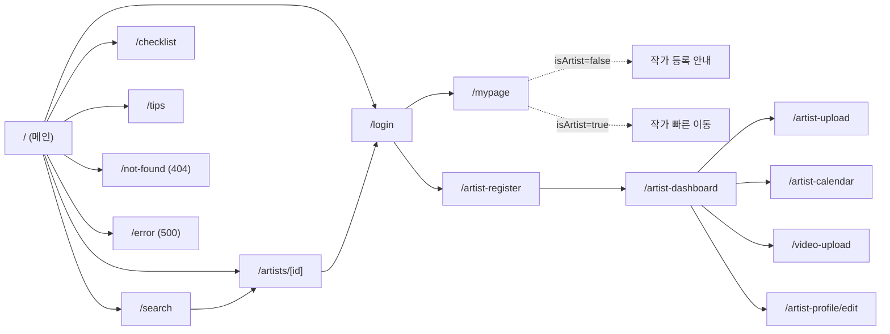

# DayPic 디자인 개편 계획서 v3

_Authors: 시니어 프로덕트 디자이너 × CTO (내부팀)_
_Reviewers v2: UX 컨설턴트 × 프론트엔드 아키텍트 (외부 1차)_
_Reviewers v3: 아트 디렉터 × 디자인 시스템 디자이너 (내부 디자이너 재토론) / PM × PO / 프리랜서 비주얼·브랜드 디자이너 (외부 2차)_
_최종 수정: 2026-04-22_
_레퍼런스: 숨고(IA·검색 UX) · Junebug Weddings · Once Wed · Magnolia Rouge · Vogue Weddings (비주얼 언어)_

> **v2 → v3 변경 규모 요약**
> v2는 UX/FE 외부 리뷰로 "데이터 정직·퍼널 일관성"은 확보했으나, **디자인 시스템 디테일·프로덕트 측정·브랜드 감정 층위**가 공백이었다. v3는 세 리뷰를 통합한다.
> - 측정·롤아웃·작가측 UX가 들어왔다 (PM+PO 20 크리틱 + KPI 트리 + 이벤트 스키마 + Sprint 3 재편)
> - 디자인 시스템이 토큰 11개 → 60+ 토큰으로 확장됐다 (AD+SD 24 크리틱)
> - 브랜드 감성 재검토가 진행됐으며, **숨고 컨셉(보라 Primary + 화이트 배경 + 절제 컬러 + Pretendard 단일)** 으로 최종 확정 (2026-04-22)

---

## 0. Executive Summary

### v3 → v4 변경 (2026-04-23, 시니어 디자이너 + PM + PO 3중 재협업)
v3는 메인 페이지(§4~§10)만 깊이 다뤘다. v4는 **13개 전 페이지 × 3-role (Designer/PM/PO) spec**을 §18~§28에 추가하고, Error Family(404/500/403/loading)와 작가 전용 모바일 하단 탭바·API Envelope 표준을 신설한다. 단일 breakpoint `pc: 800px` · 컨테이너 `max-width 1400px` · "양면 동등 노출" §6.0 쇼케이스(NEW)가 v4 기반. 총 공수: v3(5~6주) + Sprint 1 hard-cut(+2~3일) + Sprint 4·5(4주) ≈ **9~10주(~2.3 인월)**.

### Business Outcome 선언 (v3 신설)
이 개편은 **`contact_cta_clicked` 발생률(Landing→상담 시작 전환)** 을 Baseline 대비 +15% 이상 올리기 위한 투자이며, 동시에 `review_count` 데이터 부채와 `price TEXT`/`rating DEFAULT 4.8`로 쌓인 스키마 부채를 해소해 향후 **에디터 픽·유료 프로모션 레일**을 열기 위한 플랫폼 작업이다. 1.2~1.3 인월 투자로 진행하며, 효과는 Sprint 3 종료 후 7일 지표로 검증한다.

### North Star
**MAC (Monthly Active Consultations)** = 작가 상세에서 오픈채팅/전화/문의 CTA 클릭이 발생한 unique (user × artist) 세션 수 (월 집계). DayPic의 화폐화 선행지표.

### v2 → v3 주요 변경 (Top 12)

1. **측정 인프라 Phase 0 편입** — 이벤트 14종 + Feature Flag + ab_bucket + 퍼널 baseline. 측정 없는 출시 금지.
2. **단일 Phase 1(8~11일) → Sprint 3개(각 2주)로 재편**. 각 Sprint에 Goal · 데모 · DoD 5체크박스.
3. **Rollout 10% → 30% → 100% 점진 배포 + 자동 Rollback trigger** (§13.5 신설).
4. **유저 인터뷰(신부 5 + 혼주 2) Phase 0 필수**. Hero 철학 전환은 이 결과를 거친 뒤.
5. **양면 시장 건강성 점검**: 작가 측 UX 최소 패키지 Phase 2.5 (§12.5 신설), `main_image_url` 지정률 70%를 DoD에 편입.
6. **리뷰 부채 우회책**: `artists.testimonials JSONB` 자가등록 3건 (§7, PM/PO Should).
7. **디자인 토큰 대폭 확장**: Semantic 상태 컬러(success/warning/danger/info), Overlay, Focus ring, Disabled 전용 토큰. 다크모드 "미지원" 명시.
8. **타이포 4 weight(+ Hero 전용 ExtraBold)** — Medium 500 누락 해소. 숫자 tabular-nums, 한글 word-break/text-wrap, leading 매트릭스.
9. **8pt spacing scale + Container max 1400px 단일화** (2026-04-23: 1280 → 1400 상향).
10. **카드 종횡비 3:4 통일 + "액자" 처리**(외부 비주얼 권고). 평점 표기 폐기 유지.
11. **Hero 모자이크: 1 대형 + 3 소형 비대칭 에디토리얼** + 손큐레이션 SOP(주간 무드 키워드 + 팔레트 + 작가 4명).
12. **브랜드 결정 확정 (2026-04-22)**: **숨고 컨셉 채택** — Primary 보라 `#7B5CF6` 유지 + 화이트 배경 + 절제 컬러 + 그라디언트 최소화. 타이포는 Pretendard 단일(Hero 명조 페어링 보류).

### 세 리뷰 요약

| 리뷰어 | 크리틱 수 | 핵심 제안 |
|---|---|---|
| 내부 AD+SD (디자인 시스템·비주얼 미학) | 24 | 토큰 semantic·다크모드 정리·포커스 링 대비·한글 12px 하한·Medium 500·Spacing scale·Container 단일화·상태 매트릭스·Skeleton/Empty/Error·photo treatment·모션 토큰·카드 3:4 검토·Hero 큐레이션 규칙·브랜드 감성 복귀 |
| PM+PO (프로덕트 측정·우선순위) | 20 + 4 산출물 | North Star MAC·KPI 트리·이벤트 14종·MoSCoW 재분류·Sprint 3 재편·Rollout/Rollback·유저 인터뷰·양면시장·혼주 페르소나·testimonials 우회·price_min/max 구조화 |
| 외부 비주얼·브랜드 (감정·에디토리얼) | 3 답변 + 16 | 보라 폐기·Warm Ivory 전환·타이포 페어링(Hero 명조)·Hero 1+3 비대칭·손큐레이션·카드 3:4 + 액자·편집적 hover·모션 280ms easeOutExpo·라운드 축소·shadcn 70% |

---

## 0.1 North Star & KPI 트리

```
North Star: MAC (월간 신규 상담 시작 건수)
  정의: Detail 페이지 오픈채팅/전화/문의 CTA 클릭 (unique user×artist, 월 집계)
  보조: MAC per Visitor = MAC / MUV (개편의 순수 전환 효과)

├── L1-A. Discovery Depth (탐색의 깊이)
│    ├── Landing→Category/Search CTR                ≥ 42%
│    ├── Hero Mosaic Click-through                  ≥ 8%  (Hero 철학 전환의 직접 지표)
│    └── Scroll Depth to "이번 주 포트폴리오"        ≥ 55%
│
├── L1-B. Consideration Quality (비교의 질)
│    ├── Avg Artist Detail views / session          ≥ 2.3
│    ├── Favorite Add Rate                          ≥ 6%
│    └── Portfolio Lightbox Open Rate               ≥ 30%
│
└── L1-C. Conversion (전환)
     ├── Detail→Contact CTA Click                   ≥ 12% ★
     ├── Artist Profile Completeness (공급측)        ≥ 70% main_image_url 지정
     └── Return Visit within 7 days                 ≥ 22%
```

위생 지표(Lighthouse LCP<2.5s, CLS<0.05, Error rate<1%)는 별도 Ops 대시보드. KPI 트리 제외.

### KPI 충돌 해결 정책 (v4 합동 리뷰 2026-04-24)

§1 "**양면 동등 노출**" 원칙 (작가 공정 노출, §6.0 weighted_random)과 North Star **MAC** (신부 컨택 전환)은 잠재 충돌:
- 공정 회전은 작품 품질 무관 균등 노출 → 단기 MAC 최대화 ≠ 균등
- 그러나 작가 측 만족도(공정성)는 공급 풀 유지·long-tail 신부 신뢰 → long-term MAC 기여

**우선순위 정책**:
1. **단기 (Sprint 2~5)**: 공정 회전 유지 (`1 / time_since_shown` 단순 가중치). MAC 영향 30일 측정 baseline.
2. **MAC −5% 이내** (baseline 대비): 공정 회전 그대로.
3. **MAC −5% 초과**: Phase 6에서 **hybrid 가중치** 도입 → `quality_score × 0.6 + freshness × 0.4` 형태로 §6.0 정렬 재설계. quality_score는 (포트폴리오 장수 + 대표 이미지 지정 + testimonials 등록 + 응답 속도) 가중합.
4. **공급 풀 critical mass 미달** (활성 작가 < 30): 쇼케이스 자체 일시 비활성화 + 헤더에 "준비 중" 라벨 (작가 측 공정성보다 신부 측 사용성 우선).

---

## Context — 왜 이 개편인가

- 현재 DayPic 메인은 뉴모피즘 + 다중 그라디언트 + 이모지 + `font-black` 58px. 시각 밀도 과잉·정보 위계 불명. `app/globals.css:25`의 `font-family: Arial` 선언이 Geist 변수를 무력화해 한글 본문이 Arial로 렌더링되는 버그.
- 컬러/반경/섀도우가 JSX에 하드코딩되어 있어(보라 계열만 6종+) 토큰 리팩터 없이는 일괄 변경 불가.
- 스키마 부채: `rating NUMERIC DEFAULT 4.8`(전원 4.8 고정), `price TEXT` 자유 입력, `review_count` 미존재, `reviews` 테이블 0. UI만 개편하면 데이터 거짓말이 된다.
- 숨고의 "정보 위계·절제"는 IA 레퍼런스로만 흡수하고, 웨딩 프리미엄의 감정 층위는 Junebug·Once Wed·Magnolia Rouge·Vogue Weddings에서 가져온다.

**이 계획에 도달한 과정 (6단계 리뷰 체인)**
1. 현재 디자인 상태 실측
2. 숨고 분석 + 스크린샷
3. 내부 1차: 시니어 디자이너 × CTO 1차안
4. 외부 1차: UX 컨설턴트 × FE 아키텍트 비평 → **v2**
5. 내부 2차: 아트 디렉터 × 디자인 시스템 디자이너 재토론 (24 크리틱)
6. PM × PO + 외부 2차: 프리랜서 비주얼·브랜드 디자이너 병렬 리뷰 → **v3**

---

## 1. 디자인 원칙 (v3 확장)

| 원칙 | 설명 |
|---|---|
| **작품 우선** | 랜딩 1스크롤에 실제 포트폴리오 사진 필수. 폼·카피보다 이미지 우선. |
| **컬러 절제 + 감정 한 방울** | 배경은 절제. 그러나 "숨고 복제"가 아닌 "감정 있는 미니멀". 감정은 그라디언트가 아닌 **무드 이미지·손 큐레이션·photo treatment**로 낸다. |
| **위계의 투명함** | 카드·섹션은 테두리 남용 없이 **여백 + 타이포 무게 + bg-subtle 경계**로 구분 (숨고 컨셉). |
| **데이터 정직** | 수집·집계되지 않은 지표(평점·리뷰수)는 UI에 노출 금지. 거짓말이 될 수 있는 UI는 짓지 않는다. |
| **모바일 우선·2단 분기** | 62% 이상 모바일 유입 가정. **단일 breakpoint `pc: 800px`** 만 사용한다(태블릿 전용 레이아웃 없음). Hero 첫 스크롤에 썸네일 2컷 비침. 자세한 정책 §3.6. |
| **측정 가능성** (v3 신설) | 구현 완료 ≠ 배포 가능. 각 Sprint DoD에 이벤트 발사 검증 포함. |
| **양면시장 동시 개선** (v3 신설) | 신부 UI 개편 시 작가 측 UX·공급 건강성도 동시 점검. 공급 부족 → 섹션이 거짓말. |
| **양면 동등 노출** (v3 신설, 2026-04-23) | DayPic은 신랑신부의 **검색 도구**이자 동시에 작가의 **포트폴리오 사이트**다. 메인은 "큐레이션 추천"만으로 채우지 않고, **전체 작가가 공정하게 노출**되는 슬롯을 의도적으로 둔다 (§6.0). |

---

## 2. 컬러 토큰 (Tailwind v4 `@theme`)

### 2.1 브랜드 컬러 — 숨고 컨셉 확정 (2026-04-22)

**채택**: 보라 Primary 유지 + 화이트 배경 + 절제 컬러 + 그라디언트 최소화.
브랜드 오너 결정으로 확정. 외부 비주얼 디자이너가 제안한 Warm Ivory/Deep Ink 전환안은 **반영하지 않음**.

```css
/* Primary (숨고 컨셉) */
--color-primary:         #7B5CF6;  /* 기존 에쿼티 유지 */
--color-primary-hover:   #6743DC;  /* HSL L -10% S -19% */
--color-primary-active:  #5632C0;  /* pressed, L -15% */
--color-primary-soft:    #F5F0FF;  /* 아이콘 배경, 선택 tint */

/* Accent — 최소 사용. 찜 하트 fill 한 곳에만 */
--color-accent-pink:     #D75EB6;  /* 찜 liked 상태 한정 */
--color-accent-pink-soft:#FFF1F7;  /* 찜 배경 */

/* Surface */
--color-bg-base:         #FFFFFF;  /* 순백, 숨고 컨셉 */
--color-bg-subtle:       #F8F9FB;  /* 섹션 구분용 neutral gray */
--color-bg-card:         #FFFFFF;
```

**규칙**:
- 그라디언트는 **primary CTA hover 1군데로 한정**(fill → linear-gradient 135deg, primary→primary-hover). 그 외 배경·섹션·Hero 그라디언트 전면 금지.
- Pink는 찜 하트 fill·배경 외에 금지.
- 보라는 CTA·링크·포커스·카테고리 아이콘 강조에만. 섹션 배경·카드 배경으로 사용 금지.

### 2.2 공통 토큰

```css
@theme {
  /* Foreground (Text) */
  --color-fg-default:   #1A1530;  /* 대비 vs bg-base: 16.2:1 AAA */
  --color-fg-muted:     #6B6585;  /* 5.81:1 AA — 본문 허용 */
  --color-fg-subtle:    #9A94B0;  /* 3.15:1 — 본문 사용 금지, 메타·보조 라벨 전용 */
  --color-fg-disabled:  #B8B3C8;  /* Disabled 전용, 한글 획 보존 */
  --color-fg-on-primary: #FFFFFF; /* Primary 위 텍스트 */

  /* Border */
  --color-border-default: #EAE6F0;
  --color-border-strong:  #D4CEE0;
  --color-border-disabled:#E6E2EE;

  /* Focus Ring (v3 신설 — border와 분리) */
  --color-focus-ring:     #5632D4;  /* Primary보다 L -12%, 비-텍스트 대비 3:1 보장 */
  --focus-ring-width:     2px;
  --focus-ring-offset:    2px;

  /* Semantic State (v3 신설) */
  --color-success:        #14A87C;
  --color-success-soft:   #E8F7F1;
  --color-warning:        #E38A00;
  --color-warning-soft:   #FFF4E0;
  --color-danger:         #D94B4B;
  --color-danger-soft:    #FDECEC;
  --color-info:           #4A8BD6;
  --color-info-soft:      #EAF2FB;

  /* Overlay / Surface Glass (v3 신설) */
  --color-overlay-scrim:  rgba(26, 21, 48, 0.48);  /* Dialog/Lightbox 배경 */
  --color-overlay-soft:   rgba(26, 21, 48, 0.24);  /* 이미지 하단 gradient caption */
  --color-surface-glass:  rgba(255, 255, 255, 0.88); /* 찜 버튼, sticky 헤더 */
  --color-bg-disabled:    #F2EFF7;

  /* Radii & Shadow */
  --radius-card:   14px;   /* v2 20px → 14px 축소 (외부 권고: 라운드 작을수록 "인화지" 감성) */
  --radius-button: 12px;
  --radius-chip:   9999px; /* UI 기능상 chip/badge만 pill 유지 */
  --shadow-card:        0 4px 16px rgba(26, 21, 48, 0.06);
  --shadow-card-hover:  0 12px 28px rgba(26, 21, 48, 0.10);
}
```

### 2.3 다크모드 — 공식 미지원 선언 (v3 신설)
`app/globals.css:L15-19`의 `@media (prefers-color-scheme: dark)` 블록은 **Phase 0에서 완전 제거**. 이유: 웨딩 포트폴리오 감상은 화이트 배경이 절대 유리. 반쯤 살아있는 다크 CSS가 가장 나쁨. 향후 지원 시 `@custom-variant dark` 방식으로 페어 재설계.

### 2.4 하드코딩 hex 치환 대상 (Sprint 1 Day 1)
```
#faf7fc, #fcfbfe, #fbf6ff    → bg-bg-base / bg-bg-subtle
#2c2448, #2c2646, #2a2444, #2b223d → text-fg-default
#6f6888, #8a7eb0             → text-fg-muted / text-fg-subtle
#7a5cf6, #7b5cf6, #6d46f6    → text-primary / bg-primary
#ece5f5, #eee5f7, #e8def4, #ddd3ef → border-border-default / border-border-strong
```

---

## 3. 타이포그래피

### 3.1 폰트 — Pretendard 단일 확정 (2026-04-22)

Geist → **Pretendard Static Subset (Korean) 4 weight** — Regular 400 / Medium 500 / SemiBold 600 / Bold 700. `next/font/local` woff2 번들, `display: swap`, `preload: true`. `size-adjust`/`ascent-override` 디스크립터로 CLS 최소화.

**실수치 (2026-04-23 다운로드 commit `74ead97` 기준)**: orioncactus/pretendard 의 `static/woff2-subset/` 경로 weight당 ~265KB × 4 = **합계 1.07MB**. v3 v.r1 추정 "~130KB" 는 fantasy였음.

**대응 (Sprint 2 spike, 0.5d)**: 한글 일반 음절 + 라틴 + 기본 기호만 포함하는 자체 subset 도구 (`subset-font` / `pyftsubset`)로 재추출, **weight당 < 100KB / 합계 < 400KB** 목표. 미달성 시 weight 4종 → 3종(Regular/SemiBold/Bold) 로 축소 검토 (Medium 500 사용처 재평가).

**명조 페어링은 하지 않음**. 브랜드 오너 결정(숨고 컨셉 일관). Hero H1은 Bold 700으로 충분. 필요 시 ExtraBold 800 subset 1종을 Sprint 3 이후 옵션으로만 검토.

**반드시 수정**
- `app/globals.css:25` — `font-family: Arial, Helvetica, sans-serif;` **즉시 삭제** (Geist 무력화의 범인).
- `app/layout.tsx:2,6-14` — Geist/Geist_Mono 제거, Pretendard 로컬 로더로 교체.

### 3.2 스케일 (v3 확장)

| 토큰 | 클래스 | leading | 용도 |
|---|---|---|---|
| H1 Hero | `text-[44px] pc:text-[52px] font-bold tracking-[-0.01em] leading-[1.15]` | 1.15 | 랜딩 메인 |
| H2 Section | `text-[26px] pc:text-[30px] font-bold` | 1.25 | 섹션 제목 |
| H3 Card | `text-[16px] font-semibold` | 1.4 | 카드 작가명 |
| Body | `text-[15px] font-normal text-fg-muted` | 1.7 | 본문 문단 |
| Body-tight | `text-[15px] font-normal` | 1.5 | 카드 내부, 좁은 컬럼 |
| Label | `text-[13px] font-medium text-fg-subtle` (**v3 12→13px**) | 1.4 | 라벨. 한글 하한 13px |
| Button | `text-[15px] font-semibold` | 1.0 (고정 높이) | CTA |
| Micro-En | `text-[11px] font-medium font-mono` | 1.2 | 영문/숫자 전용 마이크로 라벨 |
| Price-Lg | `text-[18px] font-bold numeric` | 1.3 | 상세 페이지 가격 |
| Price-Md | `text-[15px] font-bold numeric` | 1.3 | 카드 가격 |

**규칙**:
- `font-black` (900) 전역 추방. H1은 Bold(700) 기본.
- 한글 `uppercase tracking` 조합 금지 (시각 버그).
- 한글 Label **최소 13px**. 12px 허용 금지. 더 작은 자리는 `Micro-En`로 영문/숫자만.
- **한글 자간**: H1 `-0.01em`, 섹션 H2 `0` 또는 `-0.005em`. `-0.03em`은 영문/숫자에만.

### 3.3 숫자·타이포 유틸리티 (v3 신설)

```css
@layer components {
  .numeric {
    font-feature-settings: "tnum" 1, "ss01" 1;
    font-variant-numeric: tabular-nums;
  }
}
```

- 가격·"N장"·평점(향후)·거리에 모두 `<span className="numeric">` 또는 `.numeric` 클래스 적용.
- Pretendard는 tabular-nums 지원 확인 완료.

### 3.4 한글 word-break & text-wrap (v3 신설)

```css
@layer base {
  :lang(ko) {
    word-break: keep-all;
    overflow-wrap: break-word;
  }
  h1, h2 { text-wrap: balance; }  /* 제목 음절 균형 */
  p      { text-wrap: pretty; }    /* 문단 고아 방지 */
}
```

긴 작가명("김데이픽스튜디오")·키워드("[신부가 사랑하는 감성스냅]")·Hero 카피가 모바일에서 음절 단위 쪼개지는 것 원천 차단.

---

## 3.5 여백·그리드·컨테이너 (v3 신설)

### Spacing Scale — 8pt Grid
허용 값: `1(4) / 2(8) / 3(12) / 4(16) / 6(24) / 8(32) / 12(48) / 16(64) / 24(96) / 32(128)`.
**금지**: `5(20)`, `7(28)`, `10(40)`, `14(56)`, `18(72)` 등. ESLint Tailwind 커스텀 rule로 차단.

### Section Vertical Rhythm
전 섹션 `py-16 pc:py-24` 고정. Hero만 `min-h-[540px] pc:min-h-[560px]`(55vh 이하 필수).

### Container
```css
.container-primary {
  max-width: 1400px;               /* 2026-04-23: 1280 → 1400 상향 */
  margin-inline: auto;
  padding-inline: clamp(16px, 4vw, 32px);
}
```
모든 섹션 루트가 이 유틸리티만 사용. 800px 미만에서는 `padding-inline` clamp가 16px로 수렴 → 모바일 가독 폭 확보.

### 섹션 배경 리듬 (숨고 컨셉)
Hero (White) → 카테고리 (White) → 이번 주 포트폴리오 (bg-subtle `#F8F9FB`) → 무드 (White) → DayPic POINT (bg-subtle) → FAQ (White) → CTA (Primary 반전 `#7B5CF6`) → Footer (Deep Navy `#1A1530` 유지).
섹션 경계는 **얇은 border-top `1px solid var(--color-border-default)`** 으로도 분리. bg-subtle 교차 사용을 과하게 하지 않음(숨고 컨셉: 절제).

---

## 3.6 반응형 정책 — 800px 단일 분기 (2026-04-23 확정)

본 프로젝트는 **모바일 / PC 2단**으로만 분기한다. 태블릿 전용 레이아웃은 만들지 않는다.

### 경계
- `< 800px` → **모바일** (기본값, prefix 없음)
- `≥ 800px` → **PC** (`pc:` prefix)

### Tailwind 설정
```css
@theme {
  --breakpoint-pc: 800px;
}
```
- 기본 breakpoint(`sm` 640 / `md` 768 / `lg` 1024 / `xl` 1280 / `2xl` 1536)는 **사용 금지**.
- ESLint Tailwind plugin custom rule로 `sm:`/`md:`/`lg:`/`xl:`/`2xl:` 차단.
- 단일 prefix `pc:` 만 허용.

### 작성 규칙
- 모바일을 기본값으로 두고 PC 변경분만 `pc:` 로 덮어쓴다 (mobile-first).
- 같은 prop의 값이 모바일과 PC에서 동일하면 prefix를 쓰지 않는다.
- 그리드 열수: 모바일 1~2열, PC 3~4열. 중간 열수(예: 4열) 금지.

### 컨테이너·간격
- `container-primary` 의 `padding-inline: clamp(16px, 4vw, 32px)` 는 단일 breakpoint와 무관하게 자연스러운 양옆 여백을 보장한다 → 그대로 유지.
- 섹션 vertical rhythm: 모바일 `py-16`, PC `pc:py-24`.

### 800px 경계의 시각적 검증
- Hero 모자이크: 800px 미만 = 대형 1컷 풀블리드 / 800px 이상 = 1+3+1 비대칭.
- 카드 그리드: 800px 미만 = 2열 / 800px 이상 = 3열.
- Header: 800px 미만 = 햄버거 시트 / 800px 이상 = 3+1 풀 네비.

### 이전 정책 폐기
- v3 v.r1 까지의 `md:` (768px) 기준 → `pc:` (800px) 로 일괄 치환.
- "데스크탑/태블릿/모바일" 3분기 표기 → "PC/모바일" 2분기 표기로 통일.

### 768~800 segment 측정 hook (v4 합동 리뷰 2026-04-24 추가)
800은 비표준 경계라 768~800 구간(iPad mini portrait, 일부 폴더블) 사용자가 모바일 레이아웃을 보게 됨. 본 결정은 dev velocity 우선이며 다음 측정으로 보정한다:
- Sprint 1에 **`device_breakpoint_segment`** 이벤트 발사 (param: `bucket=mobile_small(<480) | mobile_large(480-800) | pc(≥800)`, `viewport_w`)
- 30일 누적 데이터로 `mobile_large` 비율 측정
- 트래픽 5% 초과 + bounce rate 평균보다 +20% 이상이면 **v4.1에서 740 또는 880으로 재조정** 검토
- 5% 미만이면 정책 유지

---

## 4. Hero 리디자인 (v3 재설계)

### 4.1 레이아웃 — 1 대형 + 3 소형 비대칭 에디토리얼 (외부 권고)

v2의 2×2 균등 모자이크는 "모든 컷이 동등해 주연이 없는" 구성. v3는 Vogue Weddings·Junebug의 에디토리얼 레이아웃 언어.

```
┌─────────────────────────────────────────────────────────────┐
│                                                              │
│  ┌──────────────┐  ┌──────┐  평생 한 번,                    │
│  │              │  │ 소형 │  인생에 남는 사진을             │   <- h1 44~52px
│  │              │  │ 1:1  │  찾는 가장 빠른 길.             │
│  │  대형 커버   │  │      │                                 │
│  │   4:5        │  ├──────┤  ┌─────────────────────┐       │
│  │   (주간 표지) │  │ 소형 │  │ [지역 ▼] [#태그×2] │검색│   │  <- 56px pill
│  │              │  │ 1:1  │  └─────────────────────┘       │
│  │              │  │      │                                 │
│  └──────────────┘  └──────┘  인기: #본식 #야외 #서브        │
│                                                              │
│  ┌────────────────────────┐                                 │
│  │ 와이드 소형 3:1         │                                 │
│  └────────────────────────┘                                 │
└─────────────────────────────────────────────────────────────┘
배경: 순백 #FFFFFF. 그라디언트·Glow 없음 (숨고 컨셉).
```

- Hero 높이: PC `pc:min-h-[560px]`, 모바일 `min-h-[540px]`.
- 모자이크(PC, ≥800px): `grid grid-cols-3 grid-rows-3 gap-2` + `col-span-2 row-span-2`(대형) + 1+1(소형 2) + `col-span-3`(와이드).
- 각 이미지 클릭 시 작가 상세 또는 Lightbox. 이벤트 `hero_mosaic_click` 발사.
- **모바일(<800px)**: 대형 커버 1장 풀블리드 + 그 아래 h1 + 축약 검색 + 인기 chip. 3장은 `pc:hidden` 의 반대 — 모바일 DOM에서 제외(SSR 분기 또는 `hidden pc:grid`)해 data 전송 생략(성능).

### 4.2 검색 바 — 축약 유지 (지역 + 스타일 + 검색)
- `flex items-center h-14 rounded-full border border-border-default bg-white px-2 pl-5 max-w-[520px] shadow-[0_2px_8px_rgba(0,0,0,0.04)]`
- 지역: Radix `Select` / 스타일 태그: Radix `DropdownMenu` + Checkbox (멀티, 최대 2) / 검색: `Button` primary.
- **날짜 필드는 Hero에서 제거**. 상세 페이지의 "예약 가능 여부 확인"에서 받음.
- 모바일(<800px): 단일 입력 `placeholder="지역·스타일로 찾기"`, 탭 시 Radix `Dialog` 하단 시트 전개 (Framer Motion slide).

### 4.3 Hero 큐레이션 운영 SOP (v3 신설, 외부 권고)

**ΔE 자동 규칙 폐기**. 에디터 손 큐레이션 SOP:
1. 매주 월요일, 에디터(초기 창업자)가 **무드 키워드 1개 + 팔레트 3색** 정의 (예: "Soft Morning" `#F5EFE6 #D4C4B0 #8B6F47`).
2. 포트폴리오 풀에서 무드 부합 작가 4명 손으로 선정 (약 30분).
3. 2주치 미리 준비 → env 하드코딩.
4. Phase 2 이후 `featured_hero_images` 테이블 + 어드민 UI 승격.

큐레이션 제약:
- 얼굴 정면 컷은 최대 2장 (나머지는 뒷모습/디테일/반지 등).
- 같은 작가 2장 이상 금지 (작가 다양성).
- 4컷 평균 color temperature ±300K 내 권고 (사람 눈이 가능).

### 4.4 Hero B안 — 풀블리드 에디토리얼 (Phase 3 A/B 후보)
대형 이미지 1컷 풀폭 + 하단 글래스모피즘 카피 + 검색. Phase 1은 4.1(모자이크) 단일로 가고, Phase 3에서 A/B 실험 ID 등록 후 분배.

---

## 5. 카테고리 섹션 (v3 하이브리드)

### 5.1 아이콘 — 역할 분리 (외부 권고 반영)
- **UI 컨트롤 아이콘 (찜·검색·필터·햄버거·화살표 등)**: `lucide-react` 그대로 사용.
- **카테고리 8종 대표 아이콘**: **자체 라인 일러스트**로 제작. Phase 1 내 2일 일러스트 스프린트.
  - 스타일: 1.25px hairline mono-stroke, 라운드 터미네이션, `currentColor` (카드 컨텍스트에서 `text-primary` 로 렌더).
  - 크기 48×48px viewBox 24, stroke-width 1.25.
  - Kinfolk의 스팟 일러스트 언어. Duotone/Flat geometric 금지.
  - 카테고리 매핑: 본식스냅·서브스냅·영상촬영·아이폰스냅·돌스냅·야외촬영·스튜디오·해외촬영·커플스냅.

일러스트 완성 전 Placeholder로 Lucide(`Camera/Aperture/Video/Smartphone/Baby/TreePine/LampCeiling/Plane/Heart`) 임시 사용 허용. Sprint 2 종료 전 교체.

### 5.2 레이아웃
- 그리드: `grid grid-cols-2 pc:grid-cols-8 gap-3` (모바일 2×4, PC 8×1).
- 카드: `aspect-square flex flex-col items-center justify-center gap-3 rounded-2xl border border-border-default bg-white hover:border-primary hover:bg-primary-soft transition`.
- 아이콘 컨테이너: `w-12 h-12 flex items-center justify-center rounded-xl bg-primary-soft text-primary` 안에 `<BonsikIcon className="w-6 h-6" strokeWidth={1.25} />`.
- 클릭 시 `/search?service=본식스냅` 직행.

### 5.3 카테고리 통폐합
8개 유지. 통폐합(애견스냅 존치 등)은 Phase 4 이후 데이터 근거로.

---

## 6.0 "전체 작가 10인 쇼케이스" — 메인 첫 추가 섹션 (2026-04-23 신설)

### 6.0.1 목적 — 양면 동등 노출
DayPic은 신랑신부의 **검색 도구**이자 동시에 작가의 **포트폴리오 사이트**다. Hero·이번 주·에디터픽이 모두 "선별"의 언어라면, 본 섹션은 "**누구나 노출된다**"의 약속을 시각화한다. 작가가 DayPic에 등록할 동기(메인 노출)와, 신부가 대안을 발견할 권리를 동시에 충족.

### 6.0.2 배치
**Hero 직후 (섹션 #3)**. 카테고리 전, "이번 주 새 포트폴리오" 전. 검색 진입(카테고리)보다 먼저 "작품" 컷이 한 번 더 들어와 작품 우선 원칙(§1) 강화.

### 6.0.3 데이터 소스
- 엔드포인트: `/api/artists/showcase?limit=10`
- 쿼리: `artists.where(is_active = true AND main_image_url IS NOT NULL).order(weighted_random)`
- **공정 노출 규칙 (rotation)**:
  - `last_shown_at TIMESTAMPTZ` 컬럼(마이그레이션 009 신설). 매 응답마다 노출된 10명에 `now()` 갱신.
  - 정렬 가중치 (단기): `1 / (EXTRACT(EPOCH FROM (now() - COALESCE(last_shown_at, '2000-01-01'))) + 1)` 의 역순(=오래 노출 안 된 작가 우선).
  - 같은 작가가 24시간 내 다시 등장 확률 ≤ 5%.
  - **Phase 6 hybrid 가중치 도입 조건**: §0.1 KPI 충돌 정책 — MAC −5% 초과 시 `quality_score × 0.6 + freshness × 0.4` 로 재설계.
- ISR `next.revalidate: 300` (5분) — 너무 짧으면 회전 의미 사라짐, 너무 길면 신규 작가 진입 지연.
- **공급 풀 critical mass**: 활성 작가 < 30 시 §0.1 정책에 따라 쇼케이스 비활성화.

### 6.0.4 UI
- 모바일(<800px): `grid grid-cols-2 gap-3` 5행 (10장).
- PC(≥800px): `pc:grid-cols-5 pc:gap-4` 2행 (5×2).
- 카드: §7.2 `ArtistCard` 재사용 (3:4 액자, hover zoom).
- 섹션 헤더: H2 "지금 DayPic에 있는 작가들" + 우측 텍스트 링크 "전체 보기 →" (`/search`).
- 새로고침 시 일부 작가가 교체되는 것을 알리기 위해 헤더 옆 마이크로 라벨 `<Micro-En>10 of {totalCount} · 5분마다 갱신</Micro-En>`.

### 6.0.5 차별점 (다른 섹션과의 구분)
| 섹션 | 정렬 | 큐레이션 주체 | 메시지 |
|---|---|---|---|
| 6.0 전체 작가 10인 (신설) | weighted_random (공정 회전) | **알고리즘** | "DayPic의 모든 작가" |
| 6 이번 주 새 포트폴리오 | `created_at DESC` | **시간** | "최근 합류·업로드" |
| 4 Hero 모자이크 | 손큐레이션 SOP | **에디터** | "이번 주 무드 대표" |
| (Phase 4) DayPic 추천 | 손큐레이션 | **에디터** | "선별 추천" |

세 섹션이 **다른 정렬 원리**로 운영되어야 시각적·정보적 중복 없이 공존.

### 6.0.6 이벤트
- `showcase_card_clicked`: `artist_id`, `position`(0~9), `total_count`, `rotation_seed`
- §15.5 이벤트 14종 표에 #15로 추가.

### 6.0.7 작가측 가치 (포트폴리오 사이트 측면)
- 작가 대시보드에 "최근 30일 메인 노출 횟수" 카드 추가 (Sprint 3 Should).
- 작가 상세 페이지(`/artists/[id]`)는 OG 이미지 자동 생성으로 SNS 공유 시 단독 포트폴리오처럼 보이게 (Phase 4).
- 작가 본인이 "내 포트폴리오 링크"를 인스타 프로필 등에 거는 사용 패턴을 1순위로 가정 → URL 영구성·이미지 품질·로딩 속도가 검색 페이지보다 우선.

---

## 6. "이번 주 새 포트폴리오" 섹션 (v3 — 손큐레이션)

- **섹션명**: "이번 주 새 포트폴리오" 또는 "새로 합류한 작가" (공급 건강성 검증 결과에 따라).
- 정렬: `artists.created_at DESC` + `portfolio_images.created_at DESC` 최신 12명 — 단, Sprint 1에서 **주간 신규 업로드 수 ≥ 12** 검증 후 Go. 미달 시 격주 업데이트 또는 "최근 합류한 작가"로 라벨 완화.
- 엔드포인트: `/api/artists/featured` (`next.revalidate: 600` ISR 10분).
- **UI**: Embla Carousel 수평 스크롤. 탭 "전체 / 본식스냅 / 서브스냅 / 영상" 4개.
- 각 카드: `w-[260px] shrink-0 snap-start`.
- 이벤트: `featured_card_clicked` 발사.

**향후**: Phase 4에서 에디터 픽 수동 큐레이션 승격 → "DayPic 추천".

---

## 6.5 "요즘 신부들이 사랑하는 무드" (v3 신설, AD 권고)

Hero→카테고리→추천 작가로 이어지는 **효율 동선 중 감정 회복 지점**. 웨딩 유저가 머무는 이유는 "내 결혼식 상상"이다.

- 배치: "이번 주 새 포트폴리오" 다음, "DayPic이 다른 이유"(구 POINT) 앞.
- 무드 3~4개(로맨틱 야외 / 모던 스튜디오 / 빈티지 필름 / 내추럴 본식) × 각 대표 사진 2컷 + 한 줄 감성 카피.
- 클릭 시 `/search?tag=야외` 등 태그 진입.
- 데이터: 기존 태그 시스템 재활용.
- Phase 1 말 또는 Phase 2 초 도입 (Should).

---

## 7. 카드 재설계

### 7.1 ArtistCard 추출 선행 (v2 결정 유지)
- `app/search/page.tsx:1019,1133` 중복 + `app/page.tsx` + 상세 사이드바까지 4곳 공용.
- Sprint 1 Day 1 `app/components/artist/ArtistCard.tsx` 추출. 이후 모든 카드 작업의 전제.

### 7.2 카드 스펙 (v3 — 3:4 통일 + 액자)

외부 비주얼 권고를 수용해 **데스크탑·모바일 모두 3:4**로 통일. "액자" 처리로 작가간 톤 드리프트 시각 흡수.

```
┌──────────────────────────────┐
│ ┌──────────────────────────┐ │
│ │                          │ │   썸네일 3:4
│ │                          │ │   rounded-[10px] (내부)
│ │                          │ │   작가 업로드 이미지
│ │                    [♡]   │ │
│ │                          │ │
│ └──────────────────────────┘ │   <- 10px 액자 padding + 1px hairline border
│ 본식스냅                     │   text-[12px] text-primary font-medium
│ 김데이픽 작가                 │   text-[16px] font-semibold
│ 포트폴리오 42장 · 서울        │   text-[13px] text-fg-muted numeric
│ 50만원부터                   │   Price-Md 15px bold numeric
│ 후기 3건                     │   <- testimonials 우회책 (v3 추가)
└──────────────────────────────┘
   wrapper: rounded-[14px] bg-bg-card p-[10px] border border-border-default
```

**핵심 변경**:
- 종횡비 **3:4 통일** (v2의 4:5 폐기). 모바일 2열에서도 인물 디테일 보존.
- 카드 자체에 **10px padding + hairline border** (외부 권고). 이미지 주변 여백이 "액자" 역할 → 작가마다 다른 톤 흡수.
- 평점/리뷰 수 표기는 **계속 삭제** (데이터 부재). 대신 `testimonials` JSONB 3건 칩(§7.3).
- 카드 그리드: **모바일 `grid-cols-2 gap-3`, PC `pc:grid-cols-3 pc:gap-x-4 pc:gap-y-10`**. 4열은 사용하지 않음(800px 단일 분기 정책).

### 7.3 Testimonials 우회책 (v3 신설, PM/PO 권고)

리뷰 테이블 도입은 Phase 4로 밀리지만 경쟁 카드(숨고·웨딩북) 대비 허전함 문제.
- 마이그레이션 008에 `artists.testimonials JSONB` (배열, 최대 3, 각 `{ initial, wedding_date, message }`).
- 작가 편집 UI에 "고객 후기 3건 직접 입력" 섹션 (자가등록).
- 카드에는 `"후기 {n}건"` 칩 (별점·평점 아님 — 숫자만).
- Phase 4 `reviews` 테이블 정식화 시 migrate.
- 공수 1.5일, Sprint 2 Should.

### 7.4 카드 상태 매트릭스 (v3 신설)

외부 비주얼 디자이너의 "pragmatic 경로"를 채택: shadcn 70% + 브랜드 컴포넌트 3종만 선제작.

**ArtistCard는 브랜드 컴포넌트 → 상태 5종 선제작**:
- `default`: `shadow-card` + `translate-y-0`
- `hover`: `shadow-card-hover` + `translate-y-[-2px]` + 내부 이미지 `scale 1.04` (Framer Motion 320ms easeOutExpo) + caption fade-up
- `focus-visible`: `outline 2px solid var(--color-focus-ring), outline-offset 2px`
- `active`(pressed): `translate-y-0` + `shadow-card`
- `loading`: Skeleton overlay (§11.5 참조)

Button/Input/Dialog/Dropdown/Select/Tabs/Badge는 shadcn 복붙 후 실사용 중 커스텀 (§11.1).

---

## 8. 썸네일 전략 & Photo Treatment

### 8.1 main_image_url 수동 지정 (v2 유지)
- 마이그레이션 007: `artists.main_image_url TEXT` 추가.
- 작가 편집 UI(`app/artist-profile/edit`) "카드 대표 이미지 지정" 섹션.
- 렌더링 우선순위: `main_image_url` → 포트폴리오 첫 장 → Unsplash 폴백.
- `lib/cloudinary.ts`의 `buildThumbnailUrl(url, { ar: '3:4', width: 600 })`:
  - 지정 이미지: `c_fill,ar_3:4,w_600,q_auto,f_auto` (gravity center — 작가 구도 확정).
  - 폴백: `c_fill,ar_3:4,g_auto,w_600,q_auto,f_auto` (saliency-aware).

### 8.2 Photo Treatment (v3 신설, AD 권고)
카드 썸네일 CSS 필터로 미세 통일:
```css
.photo-card-media img {
  filter: saturate(0.95) contrast(1.02);
  transition: transform 320ms cubic-bezier(0.22, 1, 0.36, 1),
              filter 320ms cubic-bezier(0.22, 1, 0.36, 1);
}
.photo-card:hover .photo-card-media img {
  transform: scale(1.04);
  filter: saturate(0.98) contrast(1.04) brightness(1.04);
}
```
- 과포화 작가 사진이 튀지 않게, hover 시 은근히 생기.
- **CSS 필터는 개입 최소화. 작가 창작 해치는 LUT 강제는 금지**.
- 카드 하단 0~20% 높이에 `linear-gradient(to top, var(--color-overlay-soft), transparent)` 오버레이 — 캡션 가독성 보장.

### 8.3 런칭 전 대표 이미지 점검 스프린트 (0.5일)
Sprint 1 후반 필수. 런칭 후 "사진이 이상하게 잘려요" CS 차단. 활성 작가 대상 대표 이미지 지정률 baseline 측정.

### 8.4 작가 측 지정률 KPI
Sprint 3 DoD에 **활성 작가의 70% 이상이 `main_image_url` 지정** 편입. 미달 시 작가 대상 이메일/배너로 유도.

---

## 9. Header 개편

### 9.1 구조 — 3 + 1 (v2 유지, 디테일 확장)
```
[로고 h-8] ─ [작가 찾기][체크리스트][팁] ────── [📍지역][작가로 활동하기][로그인]
```
- 좌측 네비(신부 저니): `작가 찾기 / 체크리스트 / 팁`.
- 우측 분리 CTA(작가 진입): `작가로 활동하기` 텍스트 링크 + 유저 영역.
- 로고 **h-8 (32px)** — v2의 h-11(44px)은 2010년대 감각, 외부 권고로 축소.
- 지역 드롭다운: PC 전용(`hidden pc:flex`), localStorage 저장 → 검색 프리필 (Sprint 3).
- 모바일(<800px): `pc:hidden` 햄버거 → Radix Dialog 풀스크린 시트 + Framer Motion slide. PC(≥800px)는 풀 네비 노출.

### 9.2 브랜드 워드마크 (v3 신설, AD 권고)
H1 카피에 "DayPic" 등장 시 자동 워드마크 처리:
```css
.brand-wordmark {
  font-weight: 800;
  letter-spacing: -0.04em;
  color: var(--color-primary);
}
```
헤더 로고는 **워드마크 + 심볼마크 분리** 버전 준비: PC(≥800px) 워드마크, 모바일(<800px) 심볼마크(아이콘 30×30).

### 9.3 선결 작업 — 콘텐츠 감사 (0.5일)
`app/checklist/page.tsx`(436줄), `app/tips/page.tsx`(206줄) 콘텐츠 검증. 체크리스트 ≥ 8개 + 팁 ≥ 6개 미달 시 네비에서 강등 → 푸터.

---

## 10. 메인페이지 섹션 순서 (v3 업데이트)

| # | 섹션 | 비고 |
|---|---|---|
| 1 | Header (sticky) | — |
| 2 | Hero (1+3+1 비대칭 모자이크 + 축약 검색) | §4 |
| **3** | **전체 작가 10인 쇼케이스** (2026-04-23 신설) | §6.0 — 양면 동등 노출, weighted_random |
| **4** | **작가 CTA 배너** (v4, 2026-04-23) | §20 — 1줄 분리, "작가이신가요? 등록하기 →" |
| 5 | 카테고리 8개 (자체 일러스트) | §5 |
| 6 | **이번 주 새 포트폴리오** (Embla 캐러셀) | §6 |
| 7 | **요즘 신부들이 사랑하는 무드** (v3 신설) | §6.5 |
| 8 | DayPic이 다른 이유 (구 POINT) — 이모지 제거 | 카피 정비, Lucide 아이콘 |
| 9 | FAQ | Radix Accordion |
| 10 | 하단 CTA (작가 등록 유도) — Primary 반전 | `bg-primary` + 화이트 텍스트 |
| 11 | Footer | `#1A1530` Dark Navy 유지 |

섹션 배경 리듬(White/bg-subtle 경계) §3.5 참조.

**섹션 배경 리듬 갱신 (v4)**: Hero(White) → 전체 작가 쇼케이스(White) → 작가 CTA 배너(bg-subtle, 1줄 분리) → 카테고리(White) → 이번 주 새 포트폴리오(bg-subtle) → 무드(White) → POINT(bg-subtle) → FAQ(White) → CTA(Primary 반전) → Footer(Dark Navy). 인접 섹션 배경 동일 시 `border-top` 1px로 분리.

---

## 11. 라이브러리 스택 (v3 조정)

### 11.1 Pragmatic 경로 — shadcn 70% + 브랜드 3종 선제작 (외부 권고)

**Phase 0 (3일)**:
- shadcn Button / Input / Dialog / DropdownMenu / Tabs / Select / Badge 복붙. 컬러 토큰만 DayPic 것으로 교체.
- 이 상태로 전체 화면 1회 가동.

**Sprint 1~2 (실사용 중 학습)**:
- 필요한 variant·state만 실사용에서 발견될 때 커스텀.
- 정리되면 Figma 역산으로 컴포넌트 라이브러리화 (Sprint 3 반나절).

**예외 — 브랜드 컴포넌트 3종 선제작** (Phase 0 완료 전):
1. `ArtistCard` — hover image zoom + caption fade-up + 액자 처리.
2. `HeroMosaic` — 1+3+1 비대칭 그리드 + stagger 등장.
3. `CategoryTile` — 자체 일러스트 컨테이너 + hover stroke 전환.

### 11.2 라이브러리 목록

| 영역 | 채택 | 용도 |
|---|---|---|
| 아이콘 (UI) | `lucide-react` | 찜·검색·필터·햄버거·화살표. 트리쉐이킹 |
| 카테고리 아이콘 | 자체 SVG (Phase 1 일러스트 스프린트) | 브랜드 차별화 |
| 헤드리스 프리미티브 | Radix UI (Dialog/DropdownMenu/Tabs/Select/Tooltip/Popover/AlertDialog/NavigationMenu) | WAI-ARIA 자동 |
| 스타일 번들 | shadcn/ui 선택적 복붙 | 7개 기본 + 확장은 필요 시 |
| 캐러셀 | `embla-carousel-react` | "이번 주 새 포트폴리오" |
| 애니메이션 | `framer-motion` | 카드 hover·시트 슬라이드·모자이크 stagger |
| 폼/검증 | `react-hook-form` + `zod` | artist-profile/edit·등록·대표이미지 |
| Toast | `sonner` | 작가 대시보드 저장 성공/실패 |
| Lightbox | `yet-another-react-lightbox` | 포트폴리오 확대 |
| 날짜 유틸 | `date-fns` | 검색·휴무일 diff |
| 클래스 머지 | `clsx` + `tailwind-merge` (`cn()`) | `lib/ui/cn.ts` |
| 훅 | `usehooks-ts` (부분 발췌) | useLocalStorage/useDebounce/useMediaQuery |

### 11.3 모션 토큰 (v3 신설, 외부 권고 반영)

```css
:root {
  --motion-duration-fast:  120ms;   /* hover/focus */
  --motion-duration-base:  280ms;   /* 카드·버튼 (v2 200ms → v3 280ms) */
  --motion-duration-slow:  400ms;   /* 모달·시트·페이지 전환 */

  --motion-ease-standard:    cubic-bezier(0.22, 1, 0.36, 1);  /* easeOutExpo */
  --motion-ease-emphasize:   cubic-bezier(0.3, 0, 0, 1);
}

@media (prefers-reduced-motion: reduce) {
  *, *::before, *::after {
    animation-duration: 0.01ms !important;
    animation-iteration-count: 1 !important;
    transition-duration: 0.01ms !important;
    scroll-behavior: auto !important;
  }
}
```
Framer Motion `<MotionConfig transition={{ duration: 0.28, ease: [0.22, 1, 0.36, 1] }}>` 앱 레벨 래핑. `useReducedMotion()` 훅으로 scale/translate만 스킵, fade 유지.

### 11.4 Phase 0 설치 커맨드
```bash
npm i lucide-react \
      @radix-ui/react-dialog @radix-ui/react-dropdown-menu @radix-ui/react-tabs \
      @radix-ui/react-select @radix-ui/react-popover @radix-ui/react-tooltip \
      @radix-ui/react-alert-dialog @radix-ui/react-navigation-menu \
      embla-carousel-react framer-motion \
      react-hook-form zod @hookform/resolvers \
      sonner yet-another-react-lightbox date-fns \
      clsx tailwind-merge usehooks-ts
```

### 11.5 배제 (명시적)
- UI 풀스택 킷 (Chakra/MUI/Mantine): 토큰 철학 충돌 + 번들 거대.
- styled-components/emotion: Tailwind only.
- Redux/Zustand 등 전역 상태: **도메인 state (찜·검색 필터·작가 목록 등)** 은 localStorage + 훅으로 충분.
- TanStack Query: 현재 fetch 패턴 단순. ISR로 충분. 향후 재검토.

### 11.5.1 State 분류 (v4 합동 리뷰 2026-04-24 추가)
"전역 state 미사용" 원칙은 **도메인 state**에만 한정. 두 카테고리를 명확히 분리:

| 카테고리 | 예 | 저장소 |
|---|---|---|
| 도메인 state | 찜 목록, 검색 필터, 체크리스트 진행, 폼 입력값 | localStorage / sessionStorage / 컴포넌트 useState |
| Infrastructure state | dbError 신호, Toast queue, Modal stack, viewport breakpoint | React Context + `useSyncExternalStore` (mini pub-sub) |

Infrastructure state는 글로벌 단일 mount + 비-React EventEmitter (`lib/state/db-error-bus.ts`, `lib/state/sheet-stack.ts` 등) 형태로 허용. Redux 도입은 여전히 금지.

---

## 11.5 상태 · Empty · Error · Skeleton 정책 (v3 신설)

### Skeleton
```css
@keyframes shimmer { 0% { background-position: 200% 0 } 100% { background-position: -200% 0 } }
.skeleton {
  background: linear-gradient(90deg,
    var(--color-border-default) 0%,
    var(--color-primary-soft) 50%,
    var(--color-border-default) 100%);
  background-size: 200% 100%;
  animation: shimmer 1.6s ease-in-out infinite;
  border-radius: var(--radius-card);
}
```
- 크기·radius 실카드와 1px 단위 일치 → CLS 0.
- `prefers-reduced-motion` 시 shimmer 정지, 정적 색만.

### Empty State
공용 컴포넌트 `app/components/state/Empty.tsx`:
- 일러스트 120×120 (자체 라인, `stroke-fg-subtle`).
- H3 카피 + 감성 서브 카피 + 2차 CTA.
- 예시: "이 조건에는 아직 작품을 준비 중이에요" + "다른 주간 둘러보기".

### Error State
`Error.tsx`:
- `bg-danger-soft` 배경 + `<AlertCircle>` Lucide + 재시도 버튼.
- 서버 에러는 `/api/me` `dbError` 플래그 연동.

---

## 12. 마일스톤 (v3 — Sprint 3 재편)

### Phase 0 — 선행 (3~5일, 병렬)

- [ ] 이벤트 분석 도구 설치 (GA4 또는 PostHog 중 택1) + 이벤트 1~5·14 스펙 발사 검증
- [ ] Feature Flag + `ab_bucket` middleware + Rollback trigger 스크립트
- [ ] 퍼널 baseline 스냅샷 1페이지 (Landing→Search→Detail→Contact)
- [ ] **신부 5 + 혼주 2 원격 인터뷰 (각 30분, 질문 5종)** — Hero 철학 전환 확신 Go/No-go
- [ ] **공급 건강성 스냅샷**: 최근 30일 신규 작가·주간 포트폴리오 업로드 수 → "이번 주 새 포트폴리오" 섹션 Go/No-go
- [ ] 체크리스트/팁 콘텐츠 감사
- [ ] 라이브러리 설치 + `lib/ui/cn.ts` + shadcn 7개 복붙 + 브랜드 컴포넌트 3종 스캐폴딩
- [ ] `reviews` 테이블 설계 문서화 (생성은 Phase 4)
- [ ] 마이그레이션 007 (`main_image_url`) · 008 (`testimonials JSONB` + `price_min/max`) 계획
- ✅ **브랜드 컬러 결정 완료 (2026-04-22)**: 숨고 컨셉 (보라 Primary + 화이트 배경)

### Sprint 1 — "측정·기반·공급측 준비" (v4 합동 리뷰 2026-04-24: 1a/1b 분할)

기존 Sprint 1 (12일) 추정이 비현실 (alert·dropdown·hex 전수 치환 + Pretendard + ArtistCard + 마이그레이션 + 이벤트 + UI 2종 + Skeleton/Empty/Error 동시 진행 = 18~22일 실측). 두 sprint로 분할:

#### Sprint 1a (1주, ~6일) — Foundation
**Sprint Goal**: globals/typo/토큰/breakpoint·컨테이너 단일화 + ArtistCard 추출. 이후 모든 작업의 전제.

- `globals.css` Arial 라인 삭제 + 다크 미디어 쿼리 제거 + 토큰 재정의 (§2 확정안)
- `@theme`에 `--breakpoint-pc: 800px` + `.container-primary { max-width: 1400px }` 추가 (§3.5/§3.6)
- Pretendard 4 weight 로딩 (`next/font/local`, `public/fonts/`)
- `ArtistCard.tsx` 추출, 페이지 3곳 교체
- `lib/constants/services.ts`·`regions.ts` 이전
- `lib/ui/cn.ts` (`clsx + tailwind-merge`) + `app/providers.tsx` (MotionConfig + Sonner Toaster)

**DoD**:
- [ ] 한글 본문 Pretendard 렌더링 (Arial 0)
- [ ] `ArtistCard` 3곳 사용
- [ ] `pc:` prefix 외 분기 0건 (ESLint rule on)
- [ ] LCP 회귀 없음 (baseline 대비 ±100ms 이내)

#### Sprint 1b (2주) — Refactor + 측정 인프라 + 공급측 UI
**Sprint Goal**: 도구 일원화 hard cut + 측정 환경 + 공급측 UI 완성.

- 마이그레이션 008 (`testimonials JSONB` + `price_min/max` + `rating` NULL) + 009 (`last_shown_at`) 적용
- 작가 편집 "대표 이미지 지정" UI + "testimonials 3건 입력" UI
- 이벤트 1~5 + 14 + `device_breakpoint_segment` (§3.6) prod 발사
- **도구 일원화 hard cut**:
  - 전 페이지 `alert()` → Sonner `toast.{success,error,info}` 치환 (`/artist-upload`, `/video-upload`, `/checklist`, `/artist-calendar` 등) — Sprint 1b 종료 시점 0건
  - `MultiSelectDropdown`/`SingleSelectDropdown` (`/artist-register` 내부) → Radix Select 기반 `app/components/ui/Select.tsx` 단일 컴포넌트로 이전. `/search` 검색 폼의 region/service/price 셀렉트 동시 교체 — 0건
  - 하드코딩 hex 일괄 치환 — §2.4 매핑 표 기준 + `/search`·`/artist-*`·`/checklist`·`/tips` 추가 식별 후 0건 (ESLint custom rule로 회귀 차단)
- Skeleton/Empty/Error 신규 컴포넌트 (`app/components/state/`)

**DoD**:
- [ ] alert() / 커스텀 dropdown / hardcoded hex 모두 0건 (ESLint 통과)
- [ ] 이벤트 6종 prod 발사 확인 + 대시보드 카드 3개
- [ ] 활성 작가 대표 이미지 지정률 baseline 측정
- [ ] testimonials 입력 가능 작가 100%
- [ ] `device_breakpoint_segment` 30일 누적 시작

**일러스트 9종 외주화**: 디자이너 self 2일 추정은 비현실. 외주 1주 또는 Sprint 2로 이동. Sprint 1a/1b 어디에도 포함 안 함.

**데모**: (1) `page_view` 이벤트 1초 내 대시보드 / (2) 대표 이미지 지정 후 카드 즉시 반영 / (3) ESLint 회귀 차단 데모 / (4) 신부 인터뷰 5건 요약.

### Sprint 2 (2주) — "신부 랜딩 + 탐색 퍼널 쇄신"
**Sprint Goal**: 신부 유저에게 무드·정직·모바일 우선 경험. 10%→30% 점진 rollout.

- Hero 1+3+1 비대칭 모자이크 + 축약 검색 + 모바일 하단 시트
- 카테고리 8개 Lucide Placeholder → 자체 일러스트 순차 교체
- **전체 작가 10인 쇼케이스** §6.0 + `/api/artists/showcase` ISR + 마이그레이션 009 (`last_shown_at`)
- "이번 주 새 포트폴리오" 섹션 + `/api/artists/featured` ISR (공급 Go 판정 시)
- "요즘 신부들이 사랑하는 무드" 섹션 (Should)
- 검색 카드 3:4 + 액자 처리 + Cloudinary `buildThumbnailUrl` + 그리드 3열
- 이벤트 6~13 설치
- 상단 환영 배너(3일 dismiss) + CS FAQ 5건

**데모**: 모바일 Hero 모자이크 탭→상세 / 카테고리→검색 프리필 / 카드 그리드 / contact_cta 이벤트 발사 / Flag off 즉시 원복.

**DoD**:
- [ ] 10% 캐너리 24시간 MAC per Visitor 비악화, error<1%, LCP<2.5s
- [ ] CS FAQ 5건 게시 + 핸드오프 미팅
- [ ] 이벤트 14종 prod 검증
- [ ] CLS<0.05 (모바일/데스크탑)
- [ ] Rollback trigger 문서화

### Sprint 3 (2주) — "상세·헤더·공급측·실험 운영"
**Sprint Goal**: 퍼널 톤 일관성 완성 + 실험 프로그램 가동.

- `app/artists/[id]/page.tsx` 토큰/타이포/액자 카드 적용
- Header 3+1 구조 + 모바일 햄버거 시트 (Radix Dialog + Framer Motion)
- 작가 대시보드 Sonner 전환, 대표 이미지 지정 리마인더 배너
- Portfolio Lightbox (yet-another-react-lightbox)
- Hero sticky A/B 실험 ID 등록 (분석은 Sprint 4+)
- Rollout 30%→100%
- 런칭 회고

**데모**: Header 전 폭 3+1/햄버거 / Lightbox 상태 보존 / 100% rollout prod 대시보드 / 회고.

**DoD**:
- [ ] 100% rollout 7일 Detail→Contact 전환율 +15% 이상 (★ 성공 기준)
- [ ] 활성 작가 `main_image_url` 지정률 ≥ 70%
- [ ] 개편 회고 문서 + Phase 4 백로그
- [ ] Hero sticky A/B 실험 등록

### Phase 4 (차기) — 리뷰·에디터픽
- `reviews` 테이블 정식화 + 작성 UI
- 카드 ★ 평점 복귀 (데이터 정직 원칙 충족 이후)
- "이번 주 새 포트폴리오" → "DayPic 추천" (에디터 큐레이션)
- `price TEXT` deprecated 제거

**총 공수 (v3)**: Phase 0 5일 + Sprint 3×2주 + 버퍼 ≈ 5~6주 (1.3~1.5 인월)
**총 공수 (v4 합동 리뷰 후)**: Phase 0 5일 + Sprint 1a (1주) + Sprint 1b (2주) + Sprint 2·3 (4주) + Sprint 4·5 (4주) + 버퍼 = **~11~12주 (~2.7~3 인월)**

---

## 12.5 작가(공급측) UX 최소 패키지 (v3 신설, PM/PO)

v2의 "Header 토큰 적용 한 줄"을 확장. 양면시장 건강성 유지.

- Sprint 1: 대표 이미지 지정 UI + testimonials 입력 UI
- Sprint 2: 작가 대시보드 Sonner toast 전환 (`alert()`/`console.log` 제거)
- Sprint 3: 작가 대상 공지 이메일 1회 + 대표 이미지 지정 리마인더 배너
- KPI: `main_image_url` 지정률 ≥ 70%, testimonials 등록률 ≥ 40%

---

## 13. 수정 대상 Critical Files

| 파일 | 역할 |
|---|---|
| `app/globals.css` | `@theme` 토큰 정의, Arial 라인 삭제, 다크 미디어 쿼리 제거, layered css |
| `app/layout.tsx` | Geist → Pretendard 4 weight, body 클래스 정리, `<MotionConfig>` 래핑 |
| `app/page.tsx` | Hero 1+3+1/카테고리 일러스트/추천/무드 섹션/CTA 재구성 |
| `app/components/Header.tsx` | 네비 3+1, 모바일 시트 (Radix+Framer), 워드마크 |
| `app/components/artist/ArtistCard.tsx` | **신규** 브랜드 카드 (3:4 액자, hover zoom+caption) |
| `app/components/hero/HeroMosaic.tsx` | **신규** 1+3+1 비대칭 + stagger |
| `app/components/category/CategoryTile.tsx` | **신규** 일러스트 컨테이너 |
| `app/components/state/{Empty,Loading,Error}.tsx` | **신규** 상태 세트 |
| `app/components/ui/*` | **신규** shadcn 복붙 (Button/Input/Dialog/Dropdown/Select/Tabs/Badge) |
| `app/search/page.tsx` | 카드 교체, `useSearchParams` 초기화, 그리드 3열 |
| `app/artists/[id]/page.tsx` | 토큰/타이포/Lightbox |
| `app/artist-profile/edit/page.tsx` | 대표 이미지 지정 + testimonials 입력 |
| `app/artist-dashboard/page.tsx` | Sonner toast 전환 |
| `app/api/artists/featured/route.ts` | **신규** 최신 12명 ISR |
| `app/api/artists/showcase/route.ts` | **신규 (2026-04-23)** 전체 작가 weighted_random 10명, ISR 5분, `last_shown_at` 갱신 |
| `app/components/showcase/AllArtistsShowcase.tsx` | **신규** 메인 §6.0 그리드 (모바일 2×5, PC 5×2) |
| `lib/constants/{services,regions}.ts` | **신규** 단일 소스 |
| `lib/cloudinary.ts` | `buildThumbnailUrl({ ar: '3:4', width })` |
| `lib/ui/cn.ts` | `clsx + twMerge` 래퍼 |
| `lib/analytics/events.ts` | **신규** 14종 이벤트 발사 헬퍼 |
| `middleware.ts` | **신규** `ab_bucket` 쿠키 + Feature Flag |
| `public/icons/category/*.svg` | **신규** 자체 라인 일러스트 9종 |
| `public/fonts/Pretendard*.woff2` | **신규** 4 weight Static Subset |
| `supabase/migrations/007_main_image_url.sql` | **신규** |
| `supabase/migrations/008_testimonials_and_price_range.sql` | **신규** `testimonials JSONB`, `price_min INTEGER NOT NULL`, `price_max INTEGER`, `rating DEFAULT` 제거 후 NULL |
| `package.json` | 라이브러리 13개 추가 |
| `docs/design-system/states.md` | **신규** 실사용 후 역산 정리 (Sprint 3) |

---

## 13.5 Rollout · Rollback · CS 핸드오프 (v3 신설)

### Rollout
1. Dev → Staging → Prod
2. Prod는 `middleware.ts`의 `ab_bucket` 쿠키로 10% → 30% → 100%
3. 각 단계 최소 24~48시간 관찰
4. Sprint 2 시작 시 10%, 중반 30%, Sprint 3 중반 100%

### Rollback Trigger (자동)
- **MAC per Visitor −15% 이상, 2시간 지속** → Flag off
- **Error rate 1% 이상, 30분 지속** → Flag off
- **LCP(p75) 3s 이상, 1시간 지속** → Flag off
- 수동: 디자인 QA 실패 / CS 문의 급증

### Rollback 방법
`middleware.ts`에서 `process.env.NEXT_PUBLIC_NEW_UI_ENABLED=false` 또는 Flag Admin 패널 → 1분 내 구 UI 복귀.

### CS 핸드오프
Sprint 2 R2 배포 전:
- FAQ 5건: (1) 찜 위치 변경 (2) 검색 카드 레이아웃 (3) 대표 이미지 크롭 (4) 로그인 동일 (5) 모바일 햄버거.
- CS 담당 교육 미팅 30분.
- 인스타·카톡 공지 카피 작성.

### 유저 커뮤니케이션
- 상단 dismiss 가능 배너: "디자인이 새로워졌어요. 피드백 보내기 →" (3일 노출).
- 로그인 유저에게 이메일 1통.

### On-Call
- Sprint 2 배포 주: 주간 on-call 개발자 1명 (24h alert).
- Sprint 3 100% rollout 직후 7일: 핵심 지표 Slack 일일 리포트.

---

## 14. 재사용 가능한 기존 패턴/유틸

- `app/search/page.tsx` 의 `REGIONS`, `SERVICES` 상수 → `lib/constants/` 이전 후 공용.
- 검색 카드 JSX 중복(L1019/L1133) → `ArtistCard` 추출로 해소.
- `localStorage` 네임스페이스 `daypic_*` 유지.
- `/api/search` shuffle 로직 (featured는 분리).
- `lib/supabase.ts` `getSupabaseAdmin`·`ArtistRow` 타입.
- `useSession()` + JWT `artistId/userId` 패턴.
- `lib/auth-helpers.ts` `requireArtistOwner` — 대표이미지 PATCH·testimonials PATCH에도 사용.

---

## 15. 검증 / 테스트 플랜 (end-to-end)

### 15.1 접근성 체크리스트 (v3 신설)

**Color Contrast 실측값**
- `fg-default #1A1530` on `bg-base`: **16.2:1 AAA**
- `fg-muted #6B6585` on `bg-base`: **5.81:1 AA** (본문 사용 허용)
- `fg-subtle #9A94B0` on `bg-base`: **3.15:1** (본문 사용 금지, 메타/보조만)
- `text-primary` (`#7B5CF6`) on `primary-soft` (`#F5F0FF`): Phase 0 실측 필수
- `focus-ring #5632D4` on `bg-base`: **비-텍스트 3:1 AA 보장**

**ARIA 가이드 (필수 속성)**
- 찜 버튼: `aria-label={liked ? "찜 해제" : "찜하기"}` + `aria-pressed={liked}`
- 카테고리 카드: `<a aria-label="본식스냅 작가 검색">`
- 캐러셀: `role="region" aria-roledescription="캐러셀" aria-label="이번 주 새 포트폴리오"`, 버튼 `aria-label="이전/다음 카드"`
- 모바일 햄버거: `aria-expanded={open}` + `aria-controls={menuId}`
- Dialog: Radix 기본 `aria-modal` 신뢰
- Hero 검색 바: `<label>` 또는 `aria-labelledby`로 각 필드 연결

### 15.2 정성 검증
- `npm run dev` (포트 3001)
- Hero 작품 모자이크 1대형+3소형 노출
- Cloudinary 403/404 없음
- `document.body.style.fontFamily`가 Pretendard (Arial 아님)

### 15.3 반응형 (800px 단일 분기)
- 스냅샷: **360 / 480 / 799 / 800 / 1024 / 1440 / 1920px** (799↔800 경계 전환 시각 검증 포함)
- 1400px 초과 화면: 콘텐츠 가로 1400px 고정, 양옆 여백 자연 확장 확인
- 모바일(<800px) Hero 첫 스크롤에 카테고리 섹션 일부 비침
- 800px 직전(799px)과 직후(800px) 사이 레이아웃 점프 외 회귀 없음 (`pc:` 외 prefix 사용 0건)

### 15.4 기능 회귀
- 카테고리 클릭 → `/search?service=` 직행 + 필터 프리필
- 찜/최근본작가 localStorage
- 검색 → 상세 → 포트폴리오 뷰어 경로

### 15.5 이벤트 트래킹 스키마 (v3 신설)

모든 이벤트 공통 params: `session_id`, `user_id|null`, `device`, `ab_bucket`, `timestamp`.

| # | event_name | trigger | params |
|---|---|---|---|
| 1 | `page_view` | 라우트 진입 | `path`, `referrer` |
| 2 | `hero_mosaic_click` | Hero 모자이크 클릭 | `position`(0~3), `artist_id` |
| 3 | `hero_search_submitted` | Hero 검색 제출 | `region`, `service_tags[]` |
| 4 | `popular_chip_clicked` | 인기 chip 클릭 | `chip_label` |
| 5 | `category_clicked` | 카테고리 카드 클릭 | `service`, `grid_position` |
| 6 | `featured_card_clicked` | "이번 주" 카드 클릭 | `artist_id`, `tab`, `carousel_index` |
| 7 | `search_submitted` | `/search` 필터 적용 | `region`, `services[]`, `sort`, `result_count` |
| 8 | `search_card_clicked` | 검색 카드 클릭 | `artist_id`, `card_position`, `main_image_source` |
| 9 | `favorite_toggled` | 찜 토글 | `artist_id`, `action`, `location` |
| 10 | `artist_detail_viewed` | 상세 2s 이상 | `artist_id`, `entry_source` |
| 11 | `portfolio_lightbox_opened` | 포트폴리오 확대 | `artist_id`, `image_index` |
| 12 | `contact_cta_clicked` | **★** 상담 CTA | `artist_id`, `cta_type` |
| 13 | `artist_main_image_set` | (공급측) 대표 이미지 지정 | `artist_id`, `selected_from` |
| 14 | `ab_exposure` | 실험 bucket 노출 | `experiment_id`, `variant` |
| 15 | `showcase_card_clicked` | 메인 §6.0 카드 클릭 | `artist_id`, `position`(0~9), `total_count`, `rotation_seed` |
| 16 | `artist_cta_banner_clicked` | §20 메인 작가 CTA 배너 클릭 | `entry` (`anonymous`/`bride`) |
| 17 | `search_zero_result` | /search 결과 0건 Empty 노출 시 1회 | `region`, `services[]`, `applied_filter_count` |
| 18 | `mypage_view` | /mypage 진입 | `persona` (`bride`/`artist`) |
| 19 | `checklist_progress` | /checklist 항목 토글 (debounce 5s) | `total`, `completed`, `percent` |
| 20 | `checklist_pdf_exported` | /checklist PDF 익스포트 성공 | `completed_count`, `total` |
| 21 | `login_started` | /login 카카오 버튼 클릭 | `next` (sanitized path 또는 `null`) |
| 22 | `login_succeeded` | NextAuth callback 성공 | `is_new_user` (boolean), `is_artist` (boolean) |
| 23 | `login_failed` | NextAuth callback 실패 | `error_code` (`oauth_cancelled`/`network`/`unknown`) |
| 24 | `register_form_started` | /artist-register 첫 입력 | (no extra) |
| 25 | `register_form_submitted` | /artist-register 제출 성공 | `services_count`, `regions_count` |
| 26 | `register_form_failed` | /artist-register 제출 실패 | `reason` (`validation`/`conflict_kakao`/`conflict_email`/`server_error`) |
| 27 | `dashboard_stat_clicked` | 작가 대시보드 통계 카드 클릭 | `stat_type` (`impressions`/`clicks`/`favorites`/`closed_dates`) |
| 28 | `dashboard_action_clicked` | 작가 대시보드 액션 카드 클릭 | `action_type` (`upload`/`calendar`/`video`/`edit`) |
| 29 | `portfolio_uploaded` | /artist-upload 업로드 완료 | `count` (이번 batch), `total_after` (총 보유 장수) |
| 30 | `closed_date_added` | /artist-calendar 휴무 등록 | `date` (YYYY-MM-DD), `via` (`button`/`keyboard`) |
| 31 | `closed_date_removed` | /artist-calendar 휴무 해제 | `date`, `via` |
| 32 | `video_slot_saved` | /video-upload 저장 성공 | `slot_position` (1~4), `has_thumb` (boolean), `has_link` (boolean) |
| 33 | `profile_field_changed` | /artist-profile/edit 필드 변경 (autosave debounce 800ms) | `field_name` |
| 34 | `device_breakpoint_segment` | 라우트 진입 시 1회 (page_view 직후) | `bucket` (`mobile_small`<480 / `mobile_large`480-800 / `pc`≥800), `viewport_w` |
| — | `not_found_viewed` | /not-found.tsx 노출 | `path` (잘못된 라우트) |
| — | `error_boundary_triggered` | /error.tsx 노출 | `error_message_hash`, `route`, `digest` (Next.js error digest) |

**총 36 이벤트** (numbered 1~34 + 비-numbered 2). v3 14종 → v4 36종 (+22 신규).

**Phase 0 DoD (v4 합동 리뷰 후 갱신)**: GA4 또는 PostHog 중 택1 + #1·#14 설치 (필수 측정 인프라).

**Sprint별 이벤트 등록 일정 (v4 §12 + §28 정합)**:
- **Sprint 1a** (Foundation): #34 `device_breakpoint_segment` (768~800 segment 측정 시작 — §3.6 hedge)
- **Sprint 1b** (Refactor + 측정): #1 `page_view` 검증, #13 `artist_main_image_set` (대표 이미지 UI 동시), #18 `mypage_view`
- **Sprint 2** (랜딩·검색): #2~#5 (Hero·카테고리·검색 폼), #7·#8·#9 (검색 동작), #15 `showcase_card_clicked`, #16 `artist_cta_banner_clicked`, #17 `search_zero_result`
- **Sprint 3** (상세·실험): #6 `featured_card_clicked`, #10·#11·#12 (상세·Lightbox·★ 컨택), #14 `ab_exposure`
- **Sprint 4** (신부 보조 + Error Family): #19·#20 (체크리스트), #21~#23 (login_*), `not_found_viewed`, `error_boundary_triggered`
- **Sprint 5** (작가 스위트): #24~#26 (register_form_*), #27·#28 (dashboard_*), #29 (portfolio_uploaded), #30·#31 (closed_date_*), #32 (video_slot_saved), #33 (profile_field_changed)

### 15.6 성능
- Lighthouse LCP < 2.5s, CLS < 0.05
- Pretendard woff2 **현재 합계 1.07MB** (4 weight × ~265KB, jsdelivr static subset). Sprint 2 spike에서 자체 subset으로 < 400KB 목표 (§3.1)
- 번들 Δ < 150KB gz (라이브러리 13개 추가 후 측정 필수)

---

## 16. 리뷰 반영 요약

### v1 → v2 (외부 UX/FE 14 크리틱 반영)
| 크리틱 | 반영 |
|---|---|
| 검색 중심 Hero 웨딩 탐색 충돌 | 무드 모자이크 + 축약 검색 |
| 랜덤 셔플 "추천" 기만 | "이번 주 새 포트폴리오" + created_at DESC |
| review_count 없이 ★ 위증 | 평점·리뷰수 UI 전면 삭제 |
| 카드 4열 과밀 | `lg:grid-cols-3 2xl:grid-cols-4` |
| Cloudinary g_face 실패 | main_image_url 수동 지정 + g_auto 폴백 |
| Phase A 매몰비용 | Phase 1 Day 0로 흡수 |
| Pretendard Variable CLS | Static Subset + size-adjust |
| Header 4항목 IA 혼란 | 3+1 (좌 신부 / 우 작가) |
| ArtistCard 추출 지연 | Sprint 1 Day 1 선행 |
| QA 버퍼 0 | 각 Sprint 20% 버퍼 |
| Phase B 단독 배포 톤 불일치 | Sprint 1+2 퍼널 통합 |

### v2 → v3

#### 내부 AD+SD 24 크리틱
| 크리틱 | 반영 |
|---|---|
| Semantic 상태 컬러 0 | success/warning/danger/info 토큰 신설 |
| 다크모드 모호 | "미지원" 선언 + media query 제거 |
| Alpha overlay 토큰 부재 | scrim/soft/glass 3종 |
| 포커스 링 대비 WCAG 2.2 | `--color-focus-ring #5632D4` 분리 |
| Disabled 정책 | `fg-disabled/bg-disabled/border-disabled` |
| Primary Hover 근거 | HSL L -10% S -19% 명시 |
| 숫자 tabular-nums | `.numeric` 유틸 + `font-variant-numeric` |
| 한글 word-break | `:lang(ko) word-break: keep-all` |
| leading 매트릭스 | 전 스케일 leading 명시 |
| Medium 500 누락 | 4 weight 로드 (+ ExtraBold 선택) |
| 한글 12px 하한 | 13px + `Micro-En` 분리 |
| Spacing scale | 8pt grid 채택 |
| Container max | 1280px 단일화 |
| 카드 4상태 + 버튼 매트릭스 | ArtistCard 5상태 선제작 + shadcn pragmatic |
| Skeleton/Empty/Error 0 | §11.5 신설 |
| 모바일 aspect 4:5 → 3:4 | 전 비율 3:4 통일 (외부 합의) |
| Hero 큐레이션 ΔE | 손큐레이션 SOP로 전환 |
| Photo treatment 0 | saturate/contrast 미세 필터 + hover brightness |
| 모션 토큰 + reduced motion | §11.3 |
| Color contrast 실측 | §15.1 |
| ARIA 가이드 | §15.1 |
| 브랜드 감성 소멸 우려 | Hero glow + 무드 섹션 + 액자 처리 |
| 감성 서브 카피 | "요즘 신부들이 사랑하는 무드" §6.5 |
| Lucide tech 톤 | 하이브리드 — UI만 Lucide, 카테고리 자체 일러스트 |
| 워드마크 디테일 | §9.2 |

#### PM+PO 20 크리틱 + 4 산출물
| 크리틱 | 반영 |
|---|---|
| Business Outcome 선언 0 | §0 Executive Summary 상단 |
| North Star 0 | MAC §0.1 |
| 경쟁 분석 편향 | 레퍼런스 Junebug/Once Wed/Magnolia Rouge 추가 |
| ROI/기회비용 | §0 Business Outcome에 흡수 |
| 양면시장 공급 건강성 | Phase 0 공급 스냅샷 + §12.5 |
| 유저 인터뷰 0 | Phase 0 신부 5 + 혼주 2 필수 |
| 혼주 페르소나 누락 | "예산으로 찾기" chip + 가격 weight |
| JTBD 매핑 0 | §17 오픈 이슈 편입 |
| 퍼널 baseline 0 | Phase 0 스냅샷 |
| 이벤트 스키마 0 | §15.5 14종 |
| A/B 인프라 0 | Phase 0 Flag + middleware |
| Phase 1 과대 | Sprint 3 재편 |
| MoSCoW 0 | §12 Sprint별 분류 |
| Day 단위 = 스프린트 아님 | 2주 단위 + DoD 5체크박스 |
| DoD 부재 | Sprint별 DoD 명시 |
| Feature Flag/Rollout 0 | §13.5 |
| Changelog/CS 핸드오프 0 | §13.5 |
| 작가 측 UX "토큰 한 줄" | §12.5 |
| 리뷰 부채 경쟁력 약화 | testimonials 우회 §7.3 |
| price TEXT / rating DEFAULT | 마이그레이션 008 |

#### 외부 비주얼 16 크리틱 + 3 답변
| 크리틱 | 반영 |
|---|---|
| 브랜드 포지셔닝 모호 | Junebug + Zola 하이브리드 명시 |
| 숨고 벤치마크 치명적 | 레퍼런스 재정의 |
| DayPic 워드마크 | §9.2 |
| Primary 보라 카테고리 오류 | **반영 안함** — 숨고 컨셉 확정 (보라 유지) |
| Accent pink 2010년대 | **부분 반영** — Pink 사용 최소화 (찜 하트만) |
| 타이포 페어링 (Hero 명조) | **반영 안함** — Pretendard 단일 확정 |
| 한글 tracking 과다 | H1 -0.01em, 영문만 -0.03em |
| 이미지 톤 드리프트 | 액자 처리 §7.2 |
| 카드 border 제거 → 대시보드화 | 액자 복귀 |
| hover 편집적 인터랙션 | zoom 1.04 + caption fade-up |
| 모션 200ms → 280ms | §11.3 |
| Hero B안 풀블리드 | Phase 3 A/B 후보 |
| 섹션 배경 리듬 | §3.5 (White/bg-subtle 경계, 숨고 컨셉) |
| 모바일 "이번 주" 1열 | §6 (Embla, 모바일 고려) |
| 버튼 라운드 pill → 12px | `--radius-button: 12px` |
| Empty/Error 일러스트 | §11.5 |
| 상태 매트릭스 현실화 | shadcn 70% + 브랜드 3종 |
| 모바일 3:4 통일 | 전 비율 3:4 |
| 큐레이션 ΔE 비현실 | 손큐레이션 SOP |

---

## 17. 오픈 이슈 (v3)

### 17.1 확정된 결정 (2026-04-22 / 2026-04-23)

- ✅ **브랜드 컬러**: 숨고 컨셉 채택 — Primary 보라 `#7B5CF6` 유지, 화이트 배경, 절제 컬러, 그라디언트 primary CTA hover 1군데로 한정.
- ✅ **타이포**: Pretendard 4 weight 단일 사용. 명조 페어링·ExtraBold 추가 전부 보류.
- ✅ **다크모드**: 미지원 확정 (포트폴리오 감상 최적화).
- ✅ **반응형 (2026-04-23)**: **단일 breakpoint `pc: 800px`** 만 사용. 모바일/PC 2단 분기, 태블릿 전용 레이아웃 없음. (§3.6)
- ✅ **컨테이너 최대 가로 (2026-04-23)**: `1400px` 단일화 (이전 1280px 폐기). `padding-inline: clamp(16px, 4vw, 32px)`. (§3.5)
- ✅ **`/mypage` 폴리모픽 유지 (2026-04-23)**: 한 라우트 내부 `isArtist` 분기로 신부 뷰 + 작가 뷰. 라우트 분리 안 함. (§22.3)
- ✅ **작가 모바일 하단 탭바 도입 (2026-04-23)**: 작가 전용 라우트 5개에서 `pc:hidden` fixed bottom 64px 4탭(대시보드/사진/영상/일정). (§25)
- ✅ **도구 일원화 Sprint 1 hard cut (2026-04-23)**: alert() / 커스텀 드롭다운 / 하드코딩 hex 모두 Sprint 1 종료 시점 0건. ESLint 회귀 차단. (§12 Sprint 1)
- ✅ **API Response Envelope 표준 (2026-04-23)**: `{ ok, dbError?, error?, ...payload }` 단일 형식. `success` 키 폐기, Airtable shape leak 정규화. (§26)

### 17.2 운영

1. **Pretendard 로컬 vs CDN**: 로컬 번들 권장 (FOUT 차단, 의존성 제거).
2. **"작가로 활동하기" CTA 위치**: 우측 텍스트 링크 (권장) vs 별도 아이콘 버튼.
3. **Phase 0 `reviews` 테이블 설계 시점**: 설계 문서만 Phase 0, 실제 생성 Phase 4.
4. **Hero 모자이크 DB 승격 시점**: Phase 1 env 하드코딩, Phase 2 `featured_hero_images` 테이블 + 어드민 UI.
5. **shadcn 도입 범위**: 7개 기본 복붙. 확장은 실사용 발견 시 1개씩.
6. **Radix Select vs 네이티브 `<select>`**: 데스크탑 Radix, 모바일도 Radix 시트 모드.

### 17.3 데이터·스키마

7. **마이그레이션 008 내용**: `artists.testimonials JSONB DEFAULT '[]'::jsonb`, `artists.price_min INTEGER NOT NULL DEFAULT 0`, `artists.price_max INTEGER`, `artists.rating` 기본값 제거 후 NULL 허용, `artists.price TEXT` deprecated 마크.
8. **JTBD 별 진입 라우트**: Cold 탐색(/) / 재방문(/mypage) / 공유 진입(/artists/[id] OG). Phase 3 이후 리서치.

### 17.4 측정·실험

9. **GA4 vs PostHog**: PostHog 권장 (self-host 가능, 세션 녹화 내장). GA4는 SEO용 별도.
10. **Hotjar/Clarity 도입**: Clarity 무료 권장. Sprint 2 말 설치.
11. **NPS/CSAT 위젯**: Sprint 3 말 도입 검토.

---

## 18. IA · Site Map · Primary Journeys (v4 신설)

### 18.1 사이트맵



총 14 라우트 + 4 시스템 라우트(404/500/403/loading.tsx). 이 그래프가 §19 Auth Gate 표·§22 Page Spec·§28 Sprint 매핑의 인덱스 역할.

### 18.2 Primary Journeys (3 persona)

**A. 방문자 (cold, 비로그인)** — 80% 트래픽 가설:
```
/  →  Hero 모자이크 클릭 또는 §6.0 쇼케이스 카드 클릭  →  /artists/[id]
   →  포트폴리오 Lightbox 열람  →  하단 sticky "오픈챗 열기" 클릭 (★ contact_cta_clicked)
   →  카카오톡 외부 이탈 (또는 뒤로가기 → 더 둘러보기)
```
DoD: 로그인 없이도 ★ KPI 발생 가능. 방문자가 "찜"을 누르면 그때만 /login으로.

**B. 신부 (로그인, 비교 중)**:
```
/login (카카오)  →  /search?date=...&region=...  →  필터 칩으로 좁힘  →  카드 찜
   →  /artists/[id]  →  찜 추가  →  /mypage 찜 목록  →  N명 비교  →  최종 1명 ★ 컨택
```
DoD: 찜 6건 이상 시 /mypage 찜 패널이 정렬·삭제·최근 조회 시점을 보여줌.

**C. 작가 (공급측)**:
```
/login  →  (신규) /artist-register 폼  →  /artist-dashboard
   →  최초 1주일 내 4 액션 완수: /artist-upload (사진 ≥10장 + 대표 이미지) + /artist-calendar (휴무 입력)
       + /video-upload (선택) + /artist-profile/edit (testimonials 3건)
   →  메인 §6.0 쇼케이스 노출 시작 (last_shown_at NULL → 정렬 우선)
   →  주 1회 /artist-dashboard에서 "이번 주 노출 N회" 확인
```
DoD: 등록 7일 내 `main_image_url` 지정률 ≥ 70% (§12.5).

### 18.3 Cross-Journey 경계
- 방문자→신부 전환 트리거: 찜·문의·후기 작성(향후) 3가지만 로그인 강제. 검색·열람은 비로그인 허용.
- 신부→작가 전환: `/mypage` "작가로 활동하기" 링크 1개로만. Hero·Header에 직접 노출 안 함 (§20).

---

## 19. Auth State Machine · Route Gate Matrix (v4 신설)

### 19.1 5-state 모델

```
anonymous
  ─ login(카카오) ─→ authed_bride
                         ─ POST /artists/register ─→ authed_artist_pending
                                                         ─ admin approve / 자체 활성화 ─→ authed_artist_active
                                                                                                   ─ violation ─→ suspended
```

**state 정의** — 단일 진실원: `GET /api/me` 응답 (`isLoggedIn`, `isArtist`, 향후 `artistStatus`):

| state | isLoggedIn | isArtist | 추가 조건 (향후) |
|---|---|---|---|
| anonymous | false | false | — |
| authed_bride | true | false | — |
| authed_artist_pending | true | true | `artists.status='pending'` (마이그레이션 010) |
| authed_artist_active | true | true | `artists.status='active'` (기본값) |
| suspended | true | true | `artists.status='suspended'` → 모든 작가 라우트 403 |

현재 코드는 `authed_artist_active` ↔ `authed_artist_pending` 구분 없음. v4 §28 Sprint 5에서 마이그레이션 010 + UI 분기 도입.

### 19.2 Route Gate Matrix

| route | required state | redirect on fail | 비고 |
|---|---|---|---|
| `/` | any | — | 공개 |
| `/search` | any | — | 공개. 찜 토글만 `→ /login` |
| `/artists/[id]` | any | — | 공개. 찜 토글만 `→ /login` |
| `/checklist`, `/tips` | any | — | 공개 |
| `/login` | anonymous | `→ /` if logged | 이미 로그인 시 메인으로 |
| `/mypage` | authed_* (any) | `→ /login?next=/mypage` | 폴리모픽 |
| `/artist-register` | authed_bride | `→ /artist-dashboard` if isArtist | 이미 작가면 dashboard로 |
| `/artist-dashboard`, `/artist-upload`, `/artist-calendar`, `/video-upload`, `/artist-profile/edit` | authed_artist_active | `→ /unauthorized (403)` if bride / `→ /artist-dashboard?status=pending` if pending / `→ /login` if anonymous | suspended는 모두 403 |

### 19.3 단일 가드 헬퍼 (구현)

`lib/auth-helpers.ts`의 `requireArtistOwner`는 PATCH 권한용. 페이지 가드는 별도로:
- 서버 컴포넌트: `app/api/me`를 `await fetch` → state 분기 → `redirect(...)`
- 클라이언트 컴포넌트: 기존 패턴 유지 (`useSession()` + `useEffect` redirect)
- 권장: Sprint 5에서 `app/(artist)/layout.tsx` route group으로 작가 라우트 5개를 묶고 layout 자체가 가드. 모바일 하단 탭바(§25)도 이 layout에서 단일 mount.

### 19.4 dbError 전역 전파
`/api/me`만 `dbError`를 surface하던 v3 한계 해소. §26 envelope에 따라 모든 endpoint가 `dbError?: boolean` 반환 → 어떤 페이지에서든 `DbErrorBanner`(§22.13에서 글로벌 mount)가 한 번만 표시.

---

## 20. Two-Sided Landing — 결정 (v4 신설, 2026-04-23 확정)

### 20.1 결정: **Visitor-first, Artist-secondary CTA**

**채택**: Hero·메인 상단 영역은 **신부 voice 단일**. 작가 진입 CTA는 §6.0 "전체 작가 10인 쇼케이스" 직후에 1줄 분리 배너 (`bg-bg-subtle` + 텍스트 링크 "작가이신가요? 등록하기 →").

**기각 안**:
- ❌ Persona toggle (Hero 위 "신부 / 작가" 탭): 첫 인지 부하만 늘림. 80% 신부 가설(Sprint 1 측정)에서 80%가 의미 없는 탭을 보게 됨.
- ❌ 좌우 split Hero (좌 신부 / 우 작가): 두 voice가 서로 약화. 화이트 컨셉(§2.1)과도 충돌.
- ❌ 진입 모달 ("당신은 누구인가요?"): 새 사이트 첫 인상으로 최악.

### 20.2 작가 CTA 배너 스펙

```
┌──────────────────────────────────────────────────────────┐
│  작가이신가요?  지금 DayPic에 등록하면 메인 노출 가능합니다  →  │
└──────────────────────────────────────────────────────────┘
배치: §6.0 쇼케이스 직후 (=섹션 #4)
배경: bg-bg-subtle, 좌우 padding container-primary 동일
높이: 모바일 80px / PC 64px
타이포: text-[15px] font-medium text-fg-default + text-primary 화살표
링크: → /login?next=/artist-register (이미 로그인 시 → /artist-register 직행)
이벤트: artist_cta_banner_clicked (신규 §15.5 #16)
```

### 20.3 §10 메인 섹션 순서표 갱신
§10에 작가 CTA 배너를 섹션 #4로 삽입 → 기존 카테고리부터 한 칸씩 밀림. (§10 표는 §22 작성 후 일괄 갱신 — §28 Sprint 슬롯 참조)

### 20.4 헤더에서의 작가 진입
Header 우측 "작가로 활동하기" 텍스트 링크는 **유지**(§9.1). 메인 배너는 콘텐츠 흐름에서, 헤더 링크는 영구 anchor로 — 두 진입로를 모두 열되 시각 위계는 신부 우선.

---

## 21. Page Spec 템플릿 정의 (v4 신설)

§22의 모든 페이지 섹션은 아래 템플릿을 **순서·헤더 그대로** 따른다. 스캐너빌리티가 핵심.

### 21.1 메타 헤더 (한 줄씩 4줄)
```
@persona      [방문자 / 신부 / 작가] · @sprint [S1/S2/S3/S4/S5] · @priority [P0/P1/P2]
@file         app/<path>/page.tsx (현재 NNN lines) · @apis [/api/foo, /api/bar]
@status_v4    [신규설계 / 토큰리프레시 / 부분개편 / 유지]
@deps         [Header, ArtistCard, Empty, Skeleton, Sheet, ...] (있는 것만)
```

### 21.2 H4 섹션 4개 (고정 순서)

```
#### Designer
- 레이아웃 PC (≥800)         — 그리드/주요 영역
- 레이아웃 모바일 (<800)      — 그리드/주요 영역
- 시각 위계                  — 헤딩 스케일 (§3.2 매핑) + 주요 색 + 이미지 비율
- 마이크로 인터랙션           — hover/focus/transition (모션 토큰 §11.3 참조)
- 접근성                     — Tab 순서 / ARIA / focus-visible / prefers-reduced-motion

#### PM
- 비즈니스 목표              — 한 문장
- KPI                       — §0.1 KPI 트리 노드 직결
- 측정 이벤트                — §15.5 #N + 신규 필요 시 명시
- 스프린트 슬롯              — S? + 추정 인일

#### PO
- 사용자 스토리 (1~3건)       — "X로서, Y를 위해, Z를 한다"
- 인수 기준 (G/W/T 3~5건)
- 상태 매트릭스               — 7 상태(Loading/Empty/Error/dbError/Auth401/Forbidden403/NotFound404/OptLock409). 해당 없는 건 N/A 명시
- 엣지 케이스                 — 데이터 0/1/대량, 네트워크, 더블탭, 뒤로가기, 권한 다운그레이드

#### Implementation Pointer
- 현재 코드 핫스팟           — line ref + 1줄 요약
- 의존 컴포넌트              — §11.1 / §22.13 컴포넌트 인용
- API 계약                   — request/response shape (§26 envelope 따름)
```

### 21.3 길이 가이드
- 단순 정적 페이지(`/tips`): ≤ 80 lines
- 일반 페이지: 100~150 lines
- 복잡 페이지(`/search`, `/artist-register`, `/artist-upload`): ≤ 200 lines
- 200 초과 시 별도 부속 섹션으로 split하지 말고 **PO 상태 매트릭스를 표로 압축**

### 21.4 N/A 처리 규칙
"공개 페이지"는 Auth401/Forbidden403/OptLock409가 N/A. 작성 생략하지 않고 "N/A — 공개 페이지"라고 적어 누락이 아님을 표시.

---

## 22. Page Specs (v4 신설, 13 페이지 + Error Family)

### 22.0 / (메인 랜딩) — anchor

@persona  방문자/신부 · @sprint S1·S2·S3 (단계 분산) · @priority P0
@file     `app/page.tsx`
@status_v4 유지 + 작가 CTA 배너 1줄 추가 (§20)
@deps     Header, HeroMosaic, AllArtistsShowcase, CategoryTile, ArtistCard, FAQ, Footer

본 페이지는 §4~§10에서 이미 상세 설계됨. v4 추가 사항만:
- §6.0 직후 §20 작가 CTA 배너 (섹션 #4, 모바일 80px / PC 64px)
- §10 메인 섹션 순서표는 §28 Sprint 4에서 일괄 갱신
- 헤더는 §9.1 그대로 (3+1 구조). 모바일은 햄버거 시트.

상세 스펙은 §4 Hero / §5 카테고리 / §6.0 쇼케이스 / §6 이번 주 / §6.5 무드 / §10 순서표 / §20 작가 배너를 순서대로 참조.

---

### 22.1 /search — 작가 검색

@persona  신부 (P0) · @sprint S2 · @priority P0
@file     `app/search/page.tsx` (현재 1253 lines)
@apis     GET /api/search (date, region, service, price)
@status_v4 부분개편 — v3 §13에 카드 교체·그리드 3열 명시. v4는 결손 UX(Skeleton/Empty/모바일 Sheet/이벤트) 추가
@deps     Header, ArtistCard, Skeleton, Empty, Error, Sheet (모바일), DbErrorBanner

#### Designer
- 레이아웃 PC (≥800):
  - 좌 sidebar 280px (`sticky top-72`): 최근 본 작가 5건 + 찜한 작가 6건 (cap, "전체 보기 →" /mypage 링크)
  - 우 결과 영역 1100px 내: 상단 필터 칩 + 결과 수 라벨 + `grid grid-cols-3 gap-x-4 gap-y-10`
  - 카드는 §7.2 ArtistCard (3:4 액자, hover zoom)
- 레이아웃 모바일 (<800):
  - sidebar 제거. 상단 sticky 필터 칩 가로 스크롤 (지역·날짜·스타일·가격 4칩)
  - 칩 탭 시 Radix Dialog Sheet (`bottom-sheet 80vh`)로 풀 필터 노출 + 하단 sticky "결과 보기" 버튼
  - 그리드 `grid-cols-2 gap-3`
- 시각 위계: H2 "내 결혼식과 어울리는 작가" `text-[26px] pc:text-[30px] font-bold`. 결과 수 "전체 NN명" Body-tight muted. 카드 작가명 H3 16/600.
- 마이크로 인터랙션: 카드 hover 시 §8.2 photo treatment + `translate-y-[-2px]` (모션 base 280ms easeOutExpo). 필터 변경 시 그리드 stagger fade-in 60ms (Framer `<AnimatePresence>`).
- 접근성: 필터 칩 `role="button" aria-pressed`, sticky sidebar는 Sheet 열림 시 `inert`, Sheet ESC·focus trap (Radix 기본). 결과 수 라벨 `aria-live="polite"` (변경 시 SR 알림).

#### PM
- 비즈니스 목표: 신부가 "내 결혼식 날 가능 + 내 지역" 작가 명단에 5초 내 도달.
- KPI: §0.1 L1-A `Search Submitted → Detail Click` 전환율 (보조). MAC per Visitor에 직접 기여.
- 측정 이벤트: §15.5 #7 search_submitted, #8 search_card_clicked. **신규 #17 search_zero_result** (Empty 노출 시 1회) — Sprint 2에 등록.
- 스프린트 슬롯: S2 — 카드 교체 0.5d + Skeleton/Empty/Error 신설 0.5d + 모바일 Sheet 0.5d + sessionStorage 복원 검수 0.5d = 2d.

#### PO
- 사용자 스토리:
  1. 신부로서, 결혼식 날짜·지역을 입력해 가능 작가만 보고 싶다.
  2. 신부로서, 뒤로가기 후에도 스크롤 위치·필터가 보존되길 원한다.
  3. 신부로서, 결과가 0건일 때 다음 행동(필터 완화)을 안내받고 싶다.
- 인수 기준 (G/W/T):
  - Given 필터 미입력, When 페이지 진입, Then 전체 작가 셔플 노출 (현 동작 유지).
  - Given 결과 0건, When 노출, Then `Empty.tsx` "이 조건에 작품을 준비 중이에요" + "지역 1단계 넓히기" 버튼.
  - Given 검색 1초 이상 지연, Then `Skeleton card × 6` 노출 (CLS 0).
  - Given /search→상세→뒤로, When 복귀, Then sessionStorage scroll Y 복원 (현 동작 유지).
  - Given dbError=true, Then 상단 `DbErrorBanner` + 결과 영역은 cache fallback 시도(없으면 Empty).
- 상태 매트릭스:

  | 상태 | UI |
  |---|---|
  | Loading 초회 | Skeleton card × 6 |
  | Loading 필터변경 | 그리드 위 progress bar 2px |
  | Empty (필터 0건) | Empty + "지역 넓히기" CTA |
  | Empty (전체 0건) | 발생 안 됨 — fail loud (Sentry) |
  | Error 5xx | Error.tsx + 재시도 |
  | dbError | DbErrorBanner sticky top + 결과 영역 dim |
  | Auth 401 | N/A — 공개 |
  | 403 | N/A — 공개 |
  | 404 | N/A |
  | 409 OptLock | N/A — read-only |

- 엣지 케이스:
  - 1000+ 결과: 첫 60장 + "더 보기" 버튼 (무한 스크롤은 S5+ 검토)
  - 모바일 Sheet 열림 상태 뒤로가기: Sheet만 닫힘 (history.pushState로 가짜 history 추가)
  - 찜 6건 초과: PC sidebar 6건 cap + "전체 보기" → /mypage

#### Implementation Pointer
- 핫스팟:
  - L1019/L1133 — 카드 JSX 중복 → §13 `ArtistCard` 추출로 해소
  - 다수 — `#7a5cf6` 등 hex → §2.4 토큰 치환 (Sprint 1 hard cut)
  - 다수 — `로딩 중...` 텍스트 → `<Skeleton variant="card" count={6} />`
- 의존: ArtistCard, Empty, Skeleton, Sheet (Radix Dialog), DbErrorBanner
- API 계약 (§26):
  ```
  GET /api/search?date=&region=&service=&price=
  → { ok: true, dbError?, data: { artists: ArtistRow[], total: number } }
  // source 필드는 §26에서 폐기 권고 (분석 metric은 별도 헤더 X-DayPic-Source)
  ```

---

### 22.2 /artists/[id] — 작가 상세

@persona  방문자/신부 (P0) · @sprint S3 · @priority P0
@file     `app/artists/[id]/page.tsx`
@apis     GET /api/artists/[id]
@status_v4 부분개편 — Lightbox swipe + 모바일 sticky CTA + breadcrumb 추가
@deps     Header, ArtistCard (사이드바 추천), Lightbox, Sheet (모바일 CTA), Skeleton, DbErrorBanner

#### Designer
- 레이아웃 PC:
  - 좌 sidebar 280px sticky: "최근 본 작가" + "찜한 작가" + "이 작가와 비슷한 스타일" (S5+)
  - 우 본문: breadcrumb (`< 검색 결과로`) + 히어로 (대표 이미지 4:5 + 우측 메타 그리드: 서비스/지역/가격 from + 키워드 chip + 찜♡)
  - 본문 아래 포트폴리오 그리드 `grid-cols-3 gap-2` (이미지 비율 carded 3:4) + 영상 포트폴리오(있는 경우) `grid-cols-2`
- 레이아웃 모바일:
  - sidebar 제거. 히어로는 풀블리드 4:5 + 그 아래 메타 stack
  - 포트폴리오 그리드 `grid-cols-2 gap-2`
  - **하단 sticky CTA 64px** "오픈챗으로 문의하기" (`bg-primary text-on-primary rounded-button shadow-card-hover`) — `pc:hidden`
- 시각 위계: 작가명 H1 `text-[28px] pc:text-[32px] font-bold`. 가격 Price-Lg numeric.
- 마이크로 인터랙션: 포트폴리오 이미지 hover 시 §8.2 photo treatment. Lightbox 열 때 fade + scale 0.96→1 (300ms emphasize).
- 접근성: Lightbox `role="dialog" aria-modal aria-labelledby` + ESC·← →·Home·End 키보드 네비. 모바일 sticky CTA `aria-label="작가에게 카카오톡으로 문의"`.

#### PM
- 비즈니스 목표: 방문자가 "이 작가와 일하고 싶다" 결정 → ★ 컨택 클릭.
- KPI: §0.1 L1-C `★ Detail→Contact CTA Click ≥ 12%`. 직접 North Star 기여.
- 측정 이벤트: §15.5 #10 artist_detail_viewed (2s 이상 체류), #11 portfolio_lightbox_opened, **#12 contact_cta_clicked (★)**, #9 favorite_toggled.
- 스프린트 슬롯: S3 — Lightbox 교체(yet-another-react-lightbox + swipe) 1d + 모바일 sticky CTA 0.5d + breadcrumb·Skeleton 0.5d = 2d.

#### PO
- 사용자 스토리:
  1. 방문자로서, 작가 작품을 풀스크린으로 보고 결정하고 싶다.
  2. 신부로서, 비슷한 다른 작가를 떠나지 않고 비교하고 싶다 (사이드바).
  3. 모바일 사용자로서, 스크롤해도 문의 버튼이 항상 보이길 원한다.
- 인수 기준:
  - Given 모바일 진입, When 스크롤, Then 하단 sticky CTA 64px 유지.
  - Given Lightbox 열림 모바일, When 좌→우 swipe, Then 다음 이미지 (300ms 전환).
  - Given 잘못된 ID, When fetch 404, Then `not-found.tsx` (§22.13) 노출.
  - Given dbError=true, Then DbErrorBanner + 본문은 캐시 fallback (없으면 Error).
  - Given 로그인 안 됨 + 찜 클릭, Then `/login?next=/artists/[id]` redirect.
- 상태 매트릭스:

  | 상태 | UI |
  |---|---|
  | Loading | Skeleton (히어로 + 그리드 6장) |
  | Empty 포트폴리오 0장 | "포트폴리오 준비 중" placeholder |
  | Error 5xx | Error.tsx + 재시도 |
  | dbError | DbErrorBanner + 캐시 fallback |
  | Auth 401 | N/A (공개, 찜만 401) |
  | 403 | N/A |
  | 404 | not-found.tsx (§22.13) |
  | 409 OptLock | N/A — read-only |

- 엣지 케이스: 4종 식별자(id rec / artist_id artist_xxx / kakao_id 숫자 / email)로 진입 → `lib/artist-lookup.ts`의 `findArtistRow`가 처리. 영상 0개·1개·4개 분기. open_chat_url 없음 → CTA 비활성 + "준비 중" 라벨.

#### Implementation Pointer
- 핫스팟: 현재 Lightbox는 자체 구현(L?) — `yet-another-react-lightbox` + swipe plugin 교체. 모바일 sticky CTA는 신규 추가.
- 의존: Lightbox, Sheet, Skeleton, DbErrorBanner, ArtistCard (사이드바)
- API 계약 (§26):
  ```
  GET /api/artists/[id]
  → { ok: true, dbError?, data: { ...artist, video_portfolio_items, updated_at } }
  // 레거시 video_link_1..4, 성향키워드, keywords, success는 §26에서 폐기 schedule
  ```

---

### 22.3 /mypage — 마이페이지 (폴리모픽: 신부 뷰 + 작가 뷰)

@persona  신부 / 작가 (P1) · @sprint S4 · @priority P1
@file     `app/mypage/page.tsx`
@apis     GET /api/me
@status_v4 부분개편 — 폴리모픽 유지(2026-04-23 결정). 두 뷰 명확히 분리, Skeleton 도입
@deps     Header, DbErrorBanner, Skeleton, Card, ArtistCard (찜/최근 미니), Avatar

#### Designer
- 공통: 상단 user avatar + 이름 + 이메일 + 로그아웃 텍스트 링크. dbError 발생 시 DbErrorBanner.
- **신부 뷰** (`isArtist=false`):
  - PC: 좌 280px nav (내 정보 / 찜한 작가 / 최근 본 작가 / 작가로 활동하기) + 우 본문
  - 모바일: nav 위, 본문 아래 stack
  - "찜한 작가" 섹션: ArtistCard 그리드 `grid-cols-2 pc:grid-cols-3`. 0건일 때 `Empty` "아직 찜한 작가가 없어요" + "작가 둘러보기 →" CTA
  - "최근 본 작가" 섹션: 가로 스크롤 캐러셀 (Embla, 5건 cap)
  - "작가로 활동하기" 카드: secondary CTA, 클릭 시 `/artist-register`
- **작가 뷰** (`isArtist=true`):
  - 상단 4 카드 grid `grid-cols-2 pc:grid-cols-4` — "이번 주 노출 N회" / "포트폴리오 N장" / "찜 받은 수" / "휴무 N일"
  - 그 아래 "빠른 이동" 4 카드 — 사진 / 영상 / 일정 / 프로필 편집
  - 모바일 하단에는 §25 작가 탭바가 별도로 mount (페이지가 그릴 필요 없음)
- 시각 위계: 페이지 H1 `text-[24px] pc:text-[28px]`. 카드 H3 16/600. 숫자는 numeric tabular.
- 마이크로 인터랙션: 카드 hover 시 `translate-y-[-2px]` + shadow-card-hover.
- 접근성: nav 영역 `<nav aria-label="마이페이지 메뉴">`. 4 카드는 `<a>` 태그로 진짜 링크 (button 아님).

#### PM
- 비즈니스 목표 (신부): 찜·최근 진입로를 한 곳에 모아 재방문 유도. 비즈니스 목표 (작가): 본인 노출·포트폴리오 상태를 한눈에 → 매주 1회 방문 유도.
- KPI: §0.1 L1-C `Return Visit within 7 days ≥ 22%` (양 뷰 공통). 작가 뷰는 "main_image_url 지정률 ≥ 70%"의 리마인더 채널.
- 측정 이벤트: **신규 #18 mypage_view** (persona param). #9 favorite_toggled (찜 패널 내 삭제 시).
- 스프린트 슬롯: S4 — 1.5d.

#### PO
- 사용자 스토리:
  1. 신부로서, 찜한 작가 N명을 한 번에 비교하고 싶다.
  2. 신부로서, "작가로 활동하기" 진입로를 부담 없이 발견하고 싶다.
  3. 작가로서, 이번 주 내 작품 노출이 얼마나 됐는지 알고 싶다.
- 인수 기준:
  - Given anonymous 진입, Then `/login?next=/mypage` redirect (§19).
  - Given 신부 뷰 찜 0건, Then Empty + 둘러보기 CTA.
  - Given 작가 뷰 + dbError, Then 4 카드는 "—" 표시 + DbErrorBanner.
  - Given 작가 뷰 + main_image_url 미설정, Then 상단 노란색 reminder 배너 "대표 이미지를 지정해주세요 →" → `/artist-upload`.
- 상태 매트릭스:

  | 상태 | 신부 뷰 | 작가 뷰 |
  |---|---|---|
  | Loading | Skeleton (nav + 카드 4) | Skeleton (카드 4×2) |
  | Empty 찜 0 | Empty + CTA | N/A |
  | Empty 노출 0 | N/A | "이번 주 노출 0회" + 도움말 링크 |
  | Error | Error.tsx | Error.tsx |
  | dbError | DbErrorBanner | DbErrorBanner |
  | Auth 401 | redirect `/login?next=/mypage` | redirect `/login?next=/mypage` |
  | 403 | N/A — 폴리모픽 (양 persona 모두 진입 가능) | N/A |
  | 404 | N/A — 라우트 자체는 존재 | N/A |
  | 409 | N/A — read-only | N/A — read-only |

- 엣지 케이스: 작가가 신부처럼도 보고 싶을 때 → "신부 뷰 보기" 텍스트 링크 (S5 검토). 찜이 100건 초과 시 → Pagination (50개씩).

#### Implementation Pointer
- 핫스팟: 현재 페이지는 폴리모픽 분기는 있으나 작가 뷰가 placeholder ("다음 확장 영역") — S4에서 본격 채움. localStorage 찜·최근은 그대로.
- 의존: DbErrorBanner, ArtistCard, Skeleton, Empty, Card (ui)
- API 계약 (§26):
  ```
  GET /api/me
  → { ok: true, dbError?, data: { isLoggedIn, isArtist, userId, artistId, kakaoId, email, name } }
  ```

---

### 22.4 /checklist — 결혼 준비 체크리스트

@persona  신부 (P1) · @sprint S4 · @priority P1
@file     `app/checklist/page.tsx` (현재 ~436 lines)
@apis     없음 (localStorage `daypic_checklist_state`)
@status_v4 부분개편 — autosave + alert 제거 + UI 정돈. PDF export 유지
@deps     Header, Footer, Card, Progress, Toast (Sonner)

#### Designer
- 레이아웃 PC: 좌 360px (Hero + 진행률 카드 + select-all/clear-all 버튼) + 우 6 섹션 (체크리스트 그룹)
- 레이아웃 모바일: 단일 컬럼 stack. Hero 압축 → 진행률 카드 sticky `top-72` → 체크 그룹들
- 시각 위계: H1 "결혼 준비 체크리스트" 24/700. 각 그룹 H3 18/600. 체크 항목 Body-tight.
- 마이크로 인터랙션: 체크 토글 시 strike-through transition 200ms. 100% 도달 시 confetti (`canvas-confetti` 0.5s) + Sonner toast "축하해요! 모든 항목 완료!"
- 접근성: 체크박스 `<input type="checkbox">` (커스텀 스타일 + native semantics 유지). 진행률 `role="progressbar" aria-valuenow aria-valuemax`. PDF export 버튼 작업 중 `aria-busy="true"`.

#### PM
- 비즈니스 목표: 신부 재방문 유도 (체크리스트는 결혼 준비 기간 내내 돌아오는 콘텐츠).
- KPI: 보조 — 페이지 7일 재방문율 / 평균 체크 항목 수.
- 측정 이벤트: **신규 #19 checklist_progress** (debounce 5s, total/completed param). #20 checklist_pdf_exported.
- 스프린트 슬롯: S4 — 1d (autosave + alert 제거 + confetti).

#### PO
- 사용자 스토리:
  1. 신부로서, 한번 체크한 항목이 다음 방문에도 그대로 있길 원한다 (autosave).
  2. 신부로서, 결혼 직전에 PDF로 출력해 가족과 공유하고 싶다.
  3. 신부로서, PDF 익스포트 실패 시 명확한 안내를 받고 싶다.
- 인수 기준:
  - Given 체크 토글, When 800ms idle, Then localStorage 저장 + 우하단 micro toast "저장됨" (1s 자동 fade).
  - Given PDF 익스포트 실패 (html2canvas 에러), Then `toast.error("PDF 저장에 실패했어요. 새로고침 후 다시 시도해주세요.")`. **alert() 제거** (Sprint 1).
  - Given 모든 항목 체크, Then 1회 confetti + 축하 toast (이후 페이지 리로드 전까지 재발사 안 함).
  - Given prefers-reduced-motion, Then confetti 생략 + toast만.
- 상태 매트릭스:

  | 상태 | UI |
  |---|---|
  | Loading | N/A — localStorage 즉시 (서버 fetch 없음) |
  | Empty | 6 섹션 모두 unchecked로 시작 (정상 첫 진입 상태) |
  | Error | toast.error만 (페이지 자체는 robust) — PDF 익스포트 / localStorage write 실패 시 |
  | dbError | N/A — 서버 의존 없음 |
  | Auth 401 | N/A — 공개 |
  | 403 | N/A — 공개 |
  | 404 | N/A |
  | 409 | N/A — single-user localStorage |

- 엣지 케이스: localStorage 손상 → 빈 state로 리셋 + toast.info "저장된 진행 상태가 손상되어 초기화했어요". PDF 출력 시 모바일 width 너무 좁으면 → 데스크탑 가로폭으로 강제 렌더 (1200px viewport simulate).

#### Implementation Pointer
- 핫스팟: 현재 `alert("PDF 저장 중 오류가 발생했어요.")` → `toast.error(...)` 치환. autosave 로직 신설 (`useDebounce(state, 800)` → localStorage write).
- 의존: Toast (Sonner), Progress (ui), Card
- 외부: html2canvas + jsPDF — lazy load (`dynamic(() => import('html2canvas'), { ssr: false })`)로 초기 번들 부담 제거 (S4 DoD)

---

### 22.5 /tips — 결혼 팁 가이드

@persona  방문자/신부 (P2) · @sprint S4 · @priority P2
@file     `app/tips/page.tsx` (현재 ~206 lines)
@apis     없음 (정적)
@status_v4 부분개편 — 카드형 레이아웃 + 콘텐츠 감사 후 게시 (§9.3)
@deps     Header, Footer, Card, Accordion (선택)

#### Designer
- 레이아웃 PC: 좌 320px Hero/추천 박스 + 우 4 섹션 카드 그리드 `grid-cols-2 gap-6`
- 레이아웃 모바일: stack. 4 섹션은 1열, 각 섹션은 H2 + 서브 카드 3~4개
- 시각 위계: H1 "DayPic 결혼 팁" 24/700 + 부제 Body muted. 섹션 H2 22/700. 팁 카드 H3 16/600 + Body 14/400 leading-1.7.
- 마이크로 인터랙션: 팁 카드 hover 시 `translate-y-[-2px]`. 모바일에서 섹션을 Accordion 기본 닫힘으로 (선택, 콘텐츠 양 따라 결정 — 24개 이상이면 닫힘).
- 접근성: 헤딩 hierarchy h1→h2→h3 일관. Accordion 도입 시 Radix.

#### PM
- 비즈니스 목표: SEO + 신부 신뢰 형성. (직접 KPI 약함 — 보조)
- KPI: 보조 — `/tips` → `/search` 이동률.
- 측정 이벤트: #1 page_view 외 추가 없음.
- 스프린트 슬롯: S4 — 0.5d (레이아웃) + 콘텐츠 감사 0.5d.

#### PO
- 사용자 스토리:
  1. 방문자로서, 사진작가 선택 기준을 빠르게 훑고 싶다.
  2. 신부로서, 계약 전 체크할 사항을 알고 싶다.
- 인수 기준:
  - 콘텐츠 감사: 팁 ≥ 6 섹션 × 평균 4 항목 = 24개 이상 (§9.3). 미달 시 헤더 네비에서 강등 → Footer 링크.
  - Accordion 도입 시 Tab/Enter로 펼침 가능.
- 상태 매트릭스 (정적 페이지 — 모든 상태 N/A):

  | 상태 | UI |
  |---|---|
  | Loading | N/A — SSG/SSR 정적 |
  | Empty | N/A — 콘텐츠 항상 존재 (감사 통과 시) |
  | Error | N/A — 외부 호출 없음 |
  | dbError | N/A — 서버 의존 없음 |
  | Auth 401 | N/A — 공개 |
  | 403 | N/A — 공개 |
  | 404 | N/A — 고정 라우트 |
  | 409 | N/A — read-only |
- 엣지 케이스: 콘텐츠가 6개 미만이면 v4 머지 전 콘텐츠 추가 또는 페이지 unpublish 결정.

#### Implementation Pointer
- 핫스팟: hex 일괄 치환 (Sprint 1). Accordion 도입 시 Radix Accordion.
- 의존: Card, Accordion (선택)

---

### 22.6 /login — 카카오 로그인

@persona  방문자→신부/작가 전환 (P1) · @sprint S4 · @priority P1
@file     `app/login/page.tsx` + `LoginPageClient.tsx`
@apis     NextAuth `/api/auth/[...nextauth]` (카카오)
@status_v4 부분개편 — Suspense fallback 디자인 + 실패 toast + next 파라미터 처리
@deps     Header (간소), Toast (Sonner), Skeleton

#### Designer
- 레이아웃 (PC·모바일 동일, 폼 중앙 배치):
  - 상단 로고 (h-8) + "DayPic에 오신 것을 환영합니다" H2 + Body-tight 부제
  - 카카오 로그인 버튼 (`bg-[#FEE500] text-[#191919] h-12 rounded-button`)
  - 하단 Tiny 라벨 "로그인하면 [이용약관]·[개인정보처리방침]에 동의합니다"
- 시각 위계: 카카오 버튼이 페이지의 유일한 시각 무게. 다른 요소는 secondary.
- 마이크로 인터랙션: 버튼 hover 시 `bg-[#FDD835]` + scale 1.02. 클릭 후 spinner 0.4s 이후 카카오로 redirect.
- 접근성: 카카오 버튼 `aria-label="카카오 계정으로 로그인"`. 자동 focus.

#### PM
- 비즈니스 목표: 마찰 없는 로그인 → /artist-register or 원래 페이지 복귀.
- KPI: 로그인 성공률 (NextAuth 콜백 성공) / login_failed 발생률.
- 측정 이벤트: **신규 #21 login_started** (next param 포함), **#22 login_succeeded** (state param), **#23 login_failed** (error param).
- 스프린트 슬롯: S4 — 0.5d.

#### PO
- 사용자 스토리:
  1. 방문자로서, 카카오 한 번 클릭으로 가입·로그인하고 싶다.
  2. 방문자로서, 로그인 실패 시 "왜 실패했는지" 알고 싶다.
  3. 신부로서, 로그인 후 보던 페이지로 돌아가고 싶다 (next param).
- 인수 기준:
  - Given anonymous + 찜 클릭, When `/login?next=/artists/abc`, Then 로그인 성공 후 `/artists/abc` 자동 복귀.
  - Given 카카오 OAuth 실패 (사용자 거부), Then `toast.error("로그인이 취소되었어요. 다시 시도해주세요.")` + 페이지 유지.
  - Given Suspense pending, Then Skeleton (로고 + 버튼 placeholder) — 현재 `null` fallback 폐기.
  - Given 이미 로그인, Then `/`로 redirect (§19).
- 상태 매트릭스:

  | 상태 | UI |
  |---|---|
  | Loading (Suspense) | Skeleton (로고 + 버튼) |
  | Empty | N/A — 폼이 본질 |
  | Error (NextAuth 콜백 실패) | toast.error |
  | dbError | toast.error "일시적인 문제로 로그인이 어려워요" |
  | Auth 401 | N/A — anonymous 전용 페이지 (이미 로그인 시 §19에 의해 `/`로 redirect) |
  | 403 | N/A |
  | 404 | N/A |
  | 409 | N/A |

- 엣지 케이스: next param이 외부 도메인 → ignore + `/`로. next param이 작가 라우트인데 로그인 후 isArtist=false → `/artist-register`로 우회.

#### Implementation Pointer
- 핫스팟: 현재 Suspense fallback `null` → Skeleton 컴포넌트로 교체. NextAuth `signIn("kakao", { callbackUrl: next })` 호출 시 next 검증 추가.
- 의존: Toast, Skeleton

---

### 22.7 /artist-register — 작가 등록 폼

@persona  작가 (P0) · @sprint S5 · @priority P0
@file     `app/artist-register/page.tsx`
@apis     GET /api/me, POST /api/artists/register
@status_v4 신규설계 — 인라인 검증 + Radix Select + 모바일 시트 + autosave 초안
@deps     Header, FormField (Radix Form), Select (Radix), Input, Button, Toast, Sheet (모바일)

#### Designer
- 레이아웃 PC:
  - 단일 컬럼 max-width 720px center. Section 5개 (기본 정보 / 서비스·지역 / 가격 / 스타일 / 외부 링크) 각각 Card (`bg-bg-card border border-border-default rounded-card p-6 space-y-4`)
  - Section 사이 24px gap. 마지막에 sticky 우하단 "등록하기" Button (모바일은 sticky bottom 64px)
- 레이아웃 모바일:
  - Section을 step으로 변환 — 5 step Wizard 또는 단일 스크롤(콘텐츠 양 따라). v4는 단일 스크롤 + 각 section을 collapsible (기본 펼침) 권고. Wizard 도입은 S5 회고 후.
  - Multi-select 필드(서비스/지역/스타일)는 탭 시 BottomSheet 80vh 열림 — Sheet 안에 검색 + 칩 다중 선택 + 하단 sticky "선택 완료(N개)" 버튼
- 시각 위계: H1 "작가 등록" 24/700. Section 제목 H3 18/600. 라벨 13/500 muted. 필수 표시 `<span className="text-danger" aria-label="필수">*</span>`.
- 마이크로 인터랙션: 필드 focus 시 border-primary + soft glow (focus-ring 토큰). 검증 에러 시 24px helper 영역에 inline 메시지 (CLS 0). 제출 중 버튼 spinner.
- 접근성: `<form>` + `<FormField>` 패턴. 에러 시 `aria-invalid="true" aria-describedby={errorId}`. Sheet 포커스 트랩 (Radix). 한글 word-break (§3.4) 적용 (긴 회사명 음절 안 깨짐).

#### PM
- 비즈니스 목표: 작가 등록 마찰 최소화 → 공급 측 풀 확장 (양면 동등 노출 §1 원칙).
- KPI: 등록 폼 진입 → 제출 완료율 (보조 KPI). 등록 후 24시간 내 첫 작품 업로드율 (`/artist-upload` 진입).
- 측정 이벤트: **신규 #24 register_form_started**, **#25 register_form_submitted**, **#26 register_form_failed** (validation/conflict/server_error 분리). #13 artist_main_image_set는 후속 페이지에서.
- 스프린트 슬롯: S5 — 인라인 검증 1d + Radix Select 통합 검증 0.5d + 모바일 Sheet 1d + react-hook-form + zod 도입 0.5d = 3d.

#### PO
- 사용자 스토리:
  1. 작가로서, 어떤 필드가 필수인지 입력 전부터 알고 싶다.
  2. 작가로서, 잘못 입력한 즉시 알림을 받고 싶다 (제출 후 아니라).
  3. 작가로서, 모바일에서도 다중 선택을 편하게 하고 싶다.
- 인수 기준:
  - Given 빈 필수 필드 + 제출, Then 첫 invalid 필드로 자동 스크롤 + focus + inline 에러.
  - Given 이메일 형식 오류, When blur, Then inline 에러 ("이메일 형식이 올바르지 않아요").
  - Given 카카오 ID/이메일 중복, When 제출, Then 409 응답 → `toast.error` + 해당 필드에 inline 에러.
  - Given 모바일 + 다중 선택 필드 탭, Then BottomSheet 80vh 열림 + sticky "선택 완료" 버튼.
  - Given 제출 성공, Then `toast.success("등록 완료! 대시보드로 이동합니다")` + 700ms 후 `/artist-dashboard` redirect.
- 상태 매트릭스:

  | 상태 | UI |
  |---|---|
  | Loading (me 조회) | 폼 비활성 + Skeleton |
  | Empty | N/A — 폼이 본질 |
  | Error (5xx) | toast.error + 폼 상태 보존 |
  | dbError | DbErrorBanner + 폼은 사용 가능 (제출 시 실패할 수 있음 안내) |
  | Auth 401 | redirect /login?next=/artist-register |
  | 403 | N/A — 신부도 등록 가능 |
  | 404 | N/A |
  | 409 (UNIQUE 충돌) | inline 필드 에러 + toast.error |

- 엣지 케이스: 새로고침 시 입력 보존 (autosave to localStorage `daypic_register_draft`, 24h TTL). 등록 도중 카카오 세션 만료 → toast.warning + 자동 재로그인 시도.

#### Implementation Pointer
- 핫스팟: 현재 `MultiSelectDropdown`/`SingleSelectDropdown` (이 파일 내부 정의) → §11.1 Radix Select 기반 공통 `app/components/ui/Select.tsx`로 이전 (Sprint 1 hard cut). 검증은 react-hook-form + zod로 전면 재작성.
- 의존: FormField, Select, Input, Button, Toast, Sheet, DbErrorBanner
- API 계약 (§26):
  ```
  POST /api/artists/register
  body: { companyName, email, phone, services[], regions[], price, styleKeywords[], portfolioUrl, openchatUrl }
  → 200: { ok: true, dbError?, data: { artist: {...} } }
  → 409: { ok: false, error: { code: "UNIQUE_KAKAO" | "UNIQUE_EMAIL", message } }
  → 400: { ok: false, error: { code: "VALIDATION", message: "필수 필드 확인", fields: { fieldName: msg } } }
  ```

---

### 22.8 /artist-dashboard — 작가 홈

@persona  작가 (P0) · @sprint S5 · @priority P0
@file     `app/artist-dashboard/page.tsx`
@apis     GET /api/me, (S5 신규) GET /api/artists/[id]/stats
@status_v4 신규설계 — 단순 4 카드 link → 통계 + 액션 + 가이드 통합 home
@deps     Header, ArtistTabBar (모바일, §25), Card, Skeleton, DbErrorBanner

#### Designer
- 레이아웃 PC:
  - 상단 "안녕하세요, {작가명}님 ✨" greeting + 이번 주 통계 4 카드 (`grid-cols-4 gap-4`): 노출 N회 / 카드 클릭 N건 / 찜 받은 수 / 휴무일 N일
  - 그 아래 "작품 관리" 4 액션 카드 (`grid-cols-4 gap-4`): 사진 / 영상 / 일정 / 프로필 편집 (각 카드에 lucide 아이콘 + 현재 상태 — "사진 24장 · 대표 이미지 설정됨")
  - 우측 sticky 280px panel: "DayPic 가이드" — 4 step (Sprint 1·2·3·4 작가 onboarding 체크리스트)
- 레이아웃 모바일:
  - 통계 카드 `grid-cols-2 gap-3` (2×2)
  - 액션 카드는 §25 작가 하단 탭바로 대체 → 본문에서는 4 카드 grid 생략 또는 압축 리스트
  - 우측 가이드 panel은 본문 하단으로 이동
  - 페이지 하단 padding-bottom 80px (탭바 가림 방지)
- 시각 위계: 통계 카드 큰 숫자 H2 24/700 numeric. 액션 카드 H3 16/600. 가이드 step Tiny.
- 마이크로 인터랙션: 통계 카드 hover 시 shadow-card-hover. 숫자는 mount 시 count-up 애니 (300ms, prefers-reduced-motion 시 즉시).
- 접근성: 통계 카드 `<a aria-label="이번 주 노출 23회 — 자세히 보기">`. 액션 카드 동일.

#### PM
- 비즈니스 목표: 작가 주간 1회 방문 유도 → 작품/일정 최신성 확보 → 신부측 데이터 정직 확보.
- KPI: 작가 7일 재방문율 (보조). 통계 노출 → 액션 진입 전환율.
- 측정 이벤트: **신규 #27 dashboard_stat_clicked** (stat_type param), **#28 dashboard_action_clicked** (action_type param).
- 스프린트 슬롯: S5 — 통계 API 신설 1d + UI 1.5d = 2.5d.

#### PO
- 사용자 스토리:
  1. 작가로서, 이번 주 내 작품이 얼마나 노출됐는지 알고 싶다.
  2. 작가로서, 어떤 작업을 다음에 해야 할지 안내받고 싶다 (가이드).
  3. 작가로서, 모바일에서 빠르게 사진/영상/일정 화면으로 이동하고 싶다 (탭바).
- 인수 기준:
  - Given 작가 진입, Then 4 통계 카드 + 4 액션 카드 + 가이드 panel.
  - Given 통계 fetch 실패 (dbError), Then 카드 숫자 "—" + DbErrorBanner.
  - Given 모바일, Then 페이지 하단 padding-bottom 80px (탭바 가림 방지) + 하단 탭바 4 항목.
  - Given pending 작가 (status=pending, S5+), Then 상단 노란 배너 "심사 중" + 일부 액션 비활성.
- 상태 매트릭스:

  | 상태 | UI |
  |---|---|
  | Loading | Skeleton (통계 4 + 액션 4) |
  | Empty (작품 0) | 액션 카드에 "지금 시작하기" 강조 |
  | Error | Error.tsx |
  | dbError | DbErrorBanner + 통계 "—" |
  | Auth 401 | redirect `/login?next=/artist-dashboard` |
  | 403 (신부) | redirect /unauthorized |
  | 404 | N/A |
  | 409 | N/A — read-only |

- 엣지 케이스: 통계 API 미구현 시 → 4 카드 모두 "—" + tooltip "곧 공개돼요". main_image_url 미설정 시 → 액션 카드 "사진"에 빨간 dot indicator.

#### Implementation Pointer
- 핫스팟: 현재 단순 4 link → 통계 통합으로 본격 재구성. `/api/artists/[id]/stats` 신설(S5):
  - response: `{ ok, week_impressions, week_card_clicks, total_favorites, closed_dates_count, dbError? }`
  - 데이터 소스: `last_shown_at` 카운트 + `events` 테이블 (S5에 도입 검토)
- 의존: ArtistTabBar(§25), Card, Skeleton, DbErrorBanner

---

### 22.9 /artist-upload — 사진 포트폴리오 관리

@persona  작가 (P0) · @sprint S5 · @priority P0
@file     `app/artist-upload/page.tsx`
@apis     GET /api/me, GET /api/artists/[id], POST /api/cloudinary/sign, PATCH /api/artists/[id]/portfolio-images, PATCH /api/artists/[id]/representative-image
@status_v4 신규설계 — 대량 업로드 progress + 대표 이미지 강조 + 토큰화
@deps     Header, ArtistTabBar (모바일), Card, Toast, Sheet, Progress, ImageGrid

#### Designer
- 레이아웃 PC:
  - 상단 status card (작가명 / 기존 N장 / 새 N장 / 대표 이미지 상태)
  - 좌 "기존 포트폴리오" 섹션: 그리드 `grid-cols-3 gap-3`. 각 카드에 hover 시 floating actions (삭제 / 교체 / **★대표 지정**)
  - 우 "새 이미지 추가" 섹션: dropzone (drag&drop + 클릭) + 미리보기 그리드 + 진행률 표시 + 업로드 버튼
- 레이아웃 모바일:
  - status는 압축 chip row
  - 기존/새 섹션은 stack. 그리드 `grid-cols-2 gap-2`
  - 대표 지정은 카드 우상단 ★ 토글 (탭 시 confirmation Sheet)
  - 하단 padding-bottom 80px (탭바)
- 시각 위계: 대표 이미지 카드는 노란 border `border-warning border-2` + 좌상단 "대표" 라벨. 일반 카드는 hairline border.
- 마이크로 인터랙션: 업로드 중 카드별 progress bar 4px 하단. 완료 시 카드 fade-in 280ms. 대표 변경 시 confetti 0.3s + toast.
- 접근성: dropzone `<input type="file" aria-label="사진 추가 업로드">` (현재 hidden + 클릭 트리거 → 라벨 추가). 삭제 액션은 `<button aria-label="이미지 삭제">` + 확인 AlertDialog.

#### PM
- 비즈니스 목표: 작가의 작품 풀 풍부화 + 대표 이미지 지정률 70%↑ (§12.5 KPI).
- KPI: §12.5 `main_image_url 지정률 ≥ 70%`. 업로드된 평균 장수 / 작가.
- 측정 이벤트: **신규 #29 portfolio_uploaded** (count, total_after param). #13 artist_main_image_set (selected_from: existing/new).
- 스프린트 슬롯: S5 — 1.5d (progress UI + 대표 강조 + alert→toast).

#### PO
- 사용자 스토리:
  1. 작가로서, 한번에 10장을 올려도 진행 상황을 보고 싶다.
  2. 작가로서, 어떤 사진이 메인 카드에 쓰일지 명확히 보고 직접 정하고 싶다.
  3. 작가로서, 실수로 마지막 1장을 삭제하지 않도록 보호받고 싶다.
- 인수 기준:
  - Given 새 이미지 N장 선택, Then 미리보기 + 각 카드에 "삭제" 버튼 (업로드 전).
  - Given 업로드 시작, Then 카드별 progress bar + 전체 진행률 toast (`toast.loading("3/10 업로드 중...")`).
  - Given 마지막 1장 삭제 시도, Then AlertDialog "마지막 사진을 삭제하면 카드 노출에서 제외돼요. 그래도 삭제할까요?" → 확인 시 진행.
  - Given 파일 사이즈 초과 (> 10MB), Then 미리보기 단계에서 빨간 border + "10MB 이하만 가능" 라벨.
  - Given 대표 변경, Then 즉시 PATCH + toast.success + 카드 이동 애니.
- 상태 매트릭스:

  | 상태 | UI |
  |---|---|
  | Loading | Skeleton (status + 그리드 6) |
  | Empty 기존 0장 | "첫 작품을 올려주세요" Empty + dropzone 강조 |
  | Empty 새 0장 | dropzone만 |
  | Error 업로드 실패 | toast.error + 해당 카드 빨간 border + 재시도 버튼 |
  | dbError | DbErrorBanner + 업로드 비활성 |
  | Auth 401 | redirect `/login?next=/artist-upload` |
  | 403 (신부) | redirect /unauthorized |
  | 404 (artist 없음) | not-found.tsx |
  | 409 | N/A — `/api/artists/[id]/portfolio-images`·`/representative-image` PATCH는 `expected_updated_at` 검증 없음 (단순 upsert). 낙관적 락 도입은 Sprint 5에 §22.12와 함께 통합 검토 |

- 엣지 케이스: 40장 cap 도달 → 추가 dropzone 비활성 + 라벨 "최대 40장까지". Cloudinary 403 (sign 만료) → 재sign 후 재시도 자동 1회. 업로드 중 페이지 이탈 → AlertDialog "업로드 중인 파일이 있어요. 정말 나가실 건가요?".

#### Implementation Pointer
- 핫스팟: alert/colored 알림 → Sonner. 하드코딩 hex (red-50 등) → semantic 토큰. dropzone 신규 (현재 단순 file input).
- 의존: Toast, Sheet, AlertDialog, Progress, Card
- API 계약 (§26): 모든 PATCH는 envelope 표준. cloudinary sign은 외부.

---

### 22.10 /artist-calendar — 휴무일 관리

@persona  작가 (P0) · @sprint S5 · @priority P1
@file     `app/artist-calendar/page.tsx`
@apis     GET /api/me, GET /api/artist-closed, POST /api/artist-closed, DELETE /api/artist-closed
@status_v4 부분개편 — 키보드 네비 + ARIA grid + 모바일 폭 정돈 + alert→toast
@deps     Header, ArtistTabBar (모바일), Calendar (자체), Toast

#### Designer
- 레이아웃 PC:
  - 상단 안내 배너 (보라 점 = 촬영 불가)
  - Calendar Card (좌 720px) + Action Card (우 320px sticky)
  - Calendar: 월 nav (`<` `>`) + 요일 헤더 + 7×6 = 42 셀 (`min-h-[86px]`). 휴무일 셀에 보라 dot.
  - Action: 선택 날짜 + 상태 라벨 + "촬영 불가 등록 / 해제" Button
- 레이아웃 모바일:
  - 상하 stack. Calendar 셀 `min-h-[54px]`
  - Action Card는 페이지 하단에 sticky `bottom-[80px]` (탭바 위)
  - 하단 padding-bottom 144px (탭바 64 + Action sticky 80)
- 시각 위계: H1 "촬영 일정 관리" 24/700. 월 라벨 H2 22/700. 셀 숫자 16/500 numeric. 휴무일 dot은 `bg-primary` 6px.
- 마이크로 인터랙션: 셀 hover 시 `bg-primary-soft`. 선택 셀 `border-2 border-primary`. 등록/해제 시 dot fade-in/out 200ms.
- 접근성:
  - Calendar `role="grid" aria-label="2026년 4월 캘린더"`, 행 `role="row"`, 셀 `role="gridcell"`
  - 키보드 네비: ← → ↑ ↓로 셀 이동, Enter로 선택, PgUp/PgDn으로 월 이동
  - 휴무일 셀 `aria-pressed="true" aria-label="2026년 4월 30일 — 촬영 불가"`
  - reduced-motion 시 dot 즉시 표시

#### PM
- 비즈니스 목표: 신부 측 검색에서 가능 작가만 노출 → 데이터 정직 (§1 원칙).
- KPI: 작가의 휴무일 평균 입력 수 / 활성 작가의 월 1회 캘린더 진입율.
- 측정 이벤트: **신규 #30 closed_date_added**, **#31 closed_date_removed**.
- 스프린트 슬롯: S5 — 키보드 네비 + ARIA 1d + 모바일 정돈 0.5d + alert/inline-CSS 정리 0.5d = 2d.

#### PO
- 사용자 스토리:
  1. 작가로서, 마우스 없이 키보드만으로도 휴무일을 빠르게 입력하고 싶다.
  2. 작가로서, 한 달 단위로 휴무 패턴을 한눈에 보고 싶다.
  3. 작가로서, 등록/해제 즉시 결과를 확인하고 싶다.
- 인수 기준:
  - Given 셀 클릭, Then 즉시 Action Card 갱신 (네트워크 요청 없음).
  - Given "촬영 불가 등록" 클릭, Then POST 발사 + 낙관적 dot 표시 + toast.success / 실패 시 dot 롤백 + toast.error.
  - Given 키보드 ← → ↑ ↓, Then 인접 셀로 focus 이동.
  - Given 동일 날짜 중복 POST, Then 서버 idempotent 응답 (`duplicated: true`) + toast.info "이미 등록되어 있어요".
- 상태 매트릭스:

  | 상태 | UI |
  |---|---|
  | Loading | Skeleton (calendar grid + action) |
  | Empty 휴무 0건 | 정상 (모든 셀 흰색) |
  | Error | toast.error + 캘린더는 cached state |
  | dbError | DbErrorBanner + 등록/해제 비활성 |
  | Auth 401 | redirect `/login?next=/artist-calendar` |
  | 403 | redirect /unauthorized |
  | 404 | N/A |
  | 409 | N/A — POST/DELETE 모두 idempotent (`duplicated:true` / `already_deleted:true` 200 응답) |

- 엣지 케이스: 빠른 더블 탭 → debounce 300ms로 1회만 발사. 월 변경 시 fetch 재실행 + 이전 dot 보존 (전역 state). AbortController로 unmount 시 in-flight 취소.

#### Implementation Pointer
- 핫스팟: 현재 inline CSS-in-JS → Tailwind + 토큰 치환 (Sprint 1 hard cut). 키보드 핸들러 신설. fetchWithTimeout AbortController cleanup 추가.
- 의존: Toast, Card

---

### 22.11 /video-upload — 영상 포트폴리오 관리

@persona  작가 (P1) · @sprint S5 · @priority P1
@file     `app/video-upload/page.tsx`
@apis     GET /api/me, GET /api/artists/[id], POST /api/cloudinary/sign, PATCH /api/artists/[id]/video-portfolio
@status_v4 신규설계 — 4 슬롯 wizard + 썸네일 1:1 매핑 명시 + alert→toast
@deps     Header, ArtistTabBar (모바일), Card, Sheet, Toast, ThumbnailUploader

#### Designer
- 레이아웃 PC:
  - 상단 status (영상 N개 / 썸네일 N개 / 스타일 태그 상태)
  - 4 슬롯 카드 grid `grid-cols-2 gap-4` — 각 카드는 슬롯 #1~4. 카드 안에:
    - 좌측: 썸네일 미리보기 (4:5) + "썸네일 변경" 버튼
    - 우측: 영상 링크 input + 슬롯 라벨
  - 하단 스타일 태그 input (자유 텍스트, 칩 미리보기)
  - 하단 sticky "저장" Button
- 레이아웃 모바일:
  - 4 슬롯 1열 stack. 각 카드 내부도 stack
  - 하단 padding-bottom 80px (탭바)
- 시각 위계: 슬롯 라벨 "슬롯 #N" Tiny + 영상 링크 placeholder 명확. 빈 슬롯은 옅은 dashed border.
- 마이크로 인터랙션: 썸네일 업로드 진행률 progress bar. 저장 시 카드별 fade.
- 접근성: 썸네일 input `aria-label="슬롯 1 썸네일 업로드"`. 슬롯 카드 `<fieldset><legend>슬롯 1</legend>` 구조.

#### PM
- 비즈니스 목표: 영상 작가 노출 강화 (영상은 사진보다 conversion 효과 큼).
- KPI: 영상 등록 작가 수 / 영상 카드 클릭률 (`/search` 비디오 카드 vs 사진 카드).
- 측정 이벤트: **신규 #32 video_slot_saved** (slot_position, has_thumb param).
- 스프린트 슬롯: S5 — 1d (UI 정돈 + 1:1 매핑 명시).

#### PO
- 사용자 스토리:
  1. 작가로서, 어떤 썸네일이 어떤 영상에 짝인지 헷갈리지 않게 보고 싶다.
  2. 작가로서, 4 슬롯 중 일부만 채워도 저장되길 원한다.
  3. 작가로서, 잘못된 영상 링크를 사전에 알고 싶다.
- 인수 기준:
  - Given 슬롯 1 영상 링크 입력 + 슬롯 1 썸네일 업로드 + 저장, Then video_portfolio_items에 `position=1` row 1건만.
  - Given 슬롯 2 썸네일만 업로드 + 영상 링크 빈칸, Then 저장 시 inline 경고 "슬롯 2: 영상 링크가 필요해요".
  - Given 영상 URL 형식 오류 (http(s):// 없음 + 알 수 없는 도메인), Then blur 시 inline 경고 + 저장 가능 (서버는 관대).
  - Given 저장 성공, Then `toast.success("영상 N개 저장됨")`.
- 상태 매트릭스:

  | 상태 | UI |
  |---|---|
  | Loading | Skeleton (status + 4 슬롯) |
  | Empty (4 슬롯 전부 빔) | 정상 (저장 가능, items 0건) |
  | Error 업로드 실패 | toast.error + 해당 슬롯 빨간 border |
  | dbError | DbErrorBanner + 저장 비활성 |
  | Auth 401 | redirect `/login?next=/video-upload` |
  | 403 | redirect /unauthorized |
  | 404 | not-found.tsx |
  | 409 | N/A — `/api/artists/[id]/video-portfolio` PATCH는 `artists.updated_at` bump만 (낙관적 락 검증 없음). Sprint 5에 §22.12와 함께 통합 검토 |

- 엣지 케이스: 영상 링크는 있는데 썸네일 없음 → 썸네일 자리에 placeholder + 저장은 허용 (자동 썸네일 생성은 S6+). YouTube/Vimeo 링크 자동 ID 추출은 v4 범위 밖.

#### Implementation Pointer
- 핫스팟: alert → Sonner. 4 슬롯 매핑은 position 1..4로 명시 (현재 video_link_1..4와 동일). hex 치환 (Sprint 1).
- 의존: Toast, Card, Sheet
- API 계약 (§26):
  ```
  PATCH /api/artists/[id]/video-portfolio
  body: { video_link_1..4, video_thumb_1..4, video_style_tags }
  → { ok, dbError?, recordId } // success 키 폐기 (§26)
  ```
  내부적으로 video_portfolio_items upsert. v3 §13 deprecation schedule 그대로.

---

### 22.12 /artist-profile/edit — 작가 프로필 편집

@persona  작가 (P0) · @sprint S5 · @priority P0
@file     `app/artist-profile/edit/page.tsx`
@apis     GET /api/me, GET /api/artists/[id], PATCH /api/artists/[id]
@status_v4 신규설계 — 409 충돌 UI + autosave + Sonner + testimonials 입력
@deps     Header, ArtistTabBar (모바일), FormField, Select, Toast, AlertDialog

#### Designer
- 레이아웃 PC:
  - 단일 컬럼 max-width 720px. Section 6개 (기본 정보 / 서비스·지역 / 가격 / 스타일 / 외부 링크 / **testimonials 3건**) Card stack
  - 우상단 "변경 사항 자동 저장됨 · {시간}" muted 라벨
  - 하단 sticky "저장" Button (수동 저장 또한 가능)
- 레이아웃 모바일:
  - 단일 스크롤. Section 사이 16px gap
  - 하단 sticky 저장 Button + padding-bottom 80px (탭바)
- 시각 위계: H1 "프로필 편집" 24/700. testimonials Section H3 "고객 후기 (최대 3건)" + 부제 "신부에게 보여질 짧은 추천글".
- 마이크로 인터랙션: 필드 변경 후 800ms idle → autosave PATCH + 우상단 "저장됨" pulse. 저장 실패 시 빨간 dot.
- 접근성: 폼 필드 라벨 명시. testimonials는 `<fieldset>` + 3 row.

#### PM
- 비즈니스 목표: 작가 정보 정확성 유지 + testimonials 등록률 ≥ 40% (§12.5 KPI).
- KPI: 등록률 + autosave 기반 변경 빈도.
- 측정 이벤트: **신규 #33 profile_field_changed** (field_name param), #13은 별도 페이지.
- 스프린트 슬롯: S5 — 409 UI 0.5d + autosave 1d + testimonials 입력 0.5d = 2d.

#### PO
- 사용자 스토리:
  1. 작가로서, 가격을 바꿔도 자동 저장되어 잃지 않길 원한다.
  2. 작가로서, 다른 기기로 동시에 편집하다가 충돌해도 데이터를 잃지 않길 원한다.
  3. 작가로서, 후기 3건을 짧게 직접 등록해 카드를 풍부하게 보이고 싶다.
- 인수 기준:
  - Given 필드 변경, When 800ms idle, Then PATCH 발사 (`expected_updated_at` 동봉) + "저장됨" 표시.
  - Given 409 응답 (다른 기기에서 변경됨), Then BottomSheet/Dialog "다른 기기에서 변경되었어요" + 2 CTA: "내 변경 덮기 / 새로고침" → 사용자 선택에 따라 force PATCH 또는 GET 재실행.
  - Given testimonials 3건 초과 입력 시도, Then 4번째 row 비활성 + 라벨 "최대 3건까지".
  - Given dbError, Then DbErrorBanner + autosave 일시 중단 + "다시 시도" 버튼.
- 상태 매트릭스:

  | 상태 | UI |
  |---|---|
  | Loading | Skeleton (Section 6) |
  | Empty (신규 작가) | 폼 placeholder만 |
  | Error | toast.error + 폼 보존 |
  | dbError | DbErrorBanner + autosave 중단 |
  | Auth 401 | redirect `/login?next=/artist-profile/edit` |
  | 403 | redirect /unauthorized |
  | 404 | not-found.tsx |
  | 409 OptLock | Dialog "내 변경 덮기 / 새로고침" — **§22 내 유일하게 실 동작** (`/api/artists/[id]` PATCH의 `expected_updated_at` 검증) |

- 엣지 케이스: 동시 편집 충돌 후 "덮기" 선택 → expected_updated_at 제외하고 PATCH (force). "새로고침" → 현재 입력 폐기 후 GET 재실행 (확인 Dialog 한 번 더). autosave 도중 네트워크 끊김 → 큐에 보관 후 reconnect 시 1회 재시도.

#### Implementation Pointer
- 핫스팟: 현재 파일 미상세 — 본 v4 spec이 사실상 신규 설계. react-hook-form + zod + autosave 훅 (`useAutosave`) 도입. testimonials JSONB 필드는 마이그레이션 008 의존.
- 의존: FormField, Select, Toast, AlertDialog, DbErrorBanner
- API 계약 (§26):
  ```
  PATCH /api/artists/[id]
  body: { phone?, price?, service?, region?, style_keywords?, testimonials?, expected_updated_at }
  → 200: { ok: true, dbError?, data: { artist } }
  → 409: { ok: false, error: { code: "OPT_LOCK", message: "다른 기기에서 변경됨", details: { current_updated_at } } }
  ```

---

### 22.13 Error Family — 404 / 500 / 403 / loading

@persona  공통 (P0) · @sprint S4 · @priority P0
@file     `app/not-found.tsx`, `app/error.tsx`, `app/unauthorized/page.tsx`, `app/loading.tsx` (모두 v4 신규)
@apis     없음
@status_v4 신규설계 — Error Family 4종 + DbErrorBanner 글로벌화
@deps     EmptyIllustration, Button, Header (간소)

#### 22.13.1 not-found.tsx (404)
- 트리거: Next.js `notFound()` 호출 (예: 잘못된 artist id)
- 레이아웃: 중앙 정렬 — 일러스트 (140×140 line-art) + H2 "찾으시는 페이지가 없어요" + Body-tight muted "주소가 변경되었거나 삭제되었을 수 있어요" + 2 Button ("메인으로" Primary / "검색하러 가기" secondary)
- 모바일/PC 동일 (max-width 480px center)
- 이벤트: `not_found_viewed` (path param)

#### 22.13.2 error.tsx (500 / runtime throw)
- 트리거: 모든 unhandled error (App Router error boundary)
- 레이아웃: 중앙 정렬 — 일러스트 + H2 "잠시 문제가 생겼어요" + Body "곧 정상화될 예정이에요" + Button "다시 시도" (reset prop) + secondary "메인으로"
- Sentry capture (도입 시)
- 이벤트: `error_boundary_triggered` (error.message hash, route)

#### 22.13.3 unauthorized/page.tsx (403)
- 트리거: 신부가 작가 라우트 진입 (§19 Route Gate)
- 레이아웃: 중앙 — H2 "이 페이지는 작가만 이용할 수 있어요" + Body "DayPic 작가로 등록하면 이용 가능해요" + Button "작가 등록하기" → /artist-register / secondary "메인으로"

#### 22.13.4 loading.tsx (Suspense fallback)
- App Router는 라우트별 `loading.tsx` 자동 사용
- 페이지별 variant:
  - List 페이지(`/search`, `/mypage`): SkeletonCard × 6
  - Detail 페이지(`/artists/[id]`): SkeletonHero + SkeletonGrid
  - Form 페이지(작가 라우트): SkeletonForm (5 section)
  - Dashboard: SkeletonStat × 4 + SkeletonAction × 4
- `app/(bride)/loading.tsx`, `app/(artist)/loading.tsx` 같은 route group 별 단일 fallback 권고 (§19 route group 도입 시)

#### 22.13.5 DbErrorBanner 글로벌화
v3에서는 `/api/me` 응답만 `dbError` surface. v4는 §26에 따라 모든 endpoint가 dbError 반환 → `app/layout.tsx` body 최상단에 `<DbErrorBannerGlobal />` 1회 mount.
- 작동: 클라이언트 contexts에서 dbError state 구독. 어떤 fetch에서든 `dbError=true` 응답이 오면 5분 동안 banner 표시. 5분 내 `dbError=false` 응답 시 즉시 dismiss.
- 컴포넌트: 기존 `DbErrorBanner.tsx`는 presentational 그대로 유지 → `DbErrorBannerGlobal.tsx`가 wrapper 역할.

#### 22.13.6 DbErrorBus 구현 스케치 (§11.5.1 infrastructure state 카테고리)

```ts
// lib/state/db-error-bus.ts (Sprint 4 신설, ~30 lines)
type Listener = (active: boolean) => void;
const listeners = new Set<Listener>();
let activeUntil = 0;  // epoch ms
let snapshot = false;

function getSnapshot() { return snapshot; }
function subscribe(l: Listener) {
  listeners.add(l);
  return () => listeners.delete(l);
}
function publish(active: boolean) {
  if (active) activeUntil = Date.now() + 5 * 60 * 1000;  // 5분
  const next = active || Date.now() < activeUntil;
  if (next === snapshot) return;
  snapshot = next;
  listeners.forEach(l => l(next));
}
export const DbErrorBus = { publish, subscribe, getSnapshot };
```

```tsx
// app/components/state/DbErrorBannerGlobal.tsx (client component)
"use client";
import { useSyncExternalStore } from "react";
import { DbErrorBus } from "@/lib/state/db-error-bus";
import { DbErrorBanner } from "../DbErrorBanner";

export function DbErrorBannerGlobal() {
  const active = useSyncExternalStore(
    DbErrorBus.subscribe,
    DbErrorBus.getSnapshot,
    () => false  // SSR fallback
  );
  return <DbErrorBanner show={active} />;
}
```

```ts
// lib/api/fetcher.ts (Sprint 4 신설) — 모든 fetch가 이 wrapper 경유
import { DbErrorBus } from "@/lib/state/db-error-bus";
export async function apiFetch<T>(input: RequestInfo, init?: RequestInit): Promise<{ ok: true; data: T } | { ok: false; error: { code: string; message: string } }> {
  const res = await fetch(input, { ...init, cache: "no-store" });
  const json = await res.json();
  if (json?.dbError) DbErrorBus.publish(true);
  else if (res.ok) DbErrorBus.publish(false);
  return json;
}
```

5분 timeout은 setInterval 폴링 대신 publish 때 만료 시각 비교만 — 메모리 leak 없음. SSR에서는 항상 false (initial). Redux/Zustand 도입 없이 동작.

---

## 23. Form Pattern Catalog (v4 신설)

작가 페이지 5개와 신부 /checklist의 폼 UX를 표준화.

### 23.1 라이브러리
- **react-hook-form** + **zod** + **@hookform/resolvers/zod** — 모든 폼은 RHF + zod schema 기반.
- **shadcn Form (Radix Form 기반)** — `<Form><FormField><FormControl><FormMessage>` 컴포지션.
- **Sonner** — 모든 비-인라인 피드백.

### 23.2 인라인 검증 패턴
```tsx
<FormField
  control={form.control}
  name="email"
  render={({ field, fieldState }) => (
    <FormItem>
      <FormLabel>이메일 <span className="text-danger">*</span></FormLabel>
      <FormControl>
        <Input {...field} aria-invalid={!!fieldState.error} />
      </FormControl>
      <FormMessage className="min-h-6" /> {/* 항상 24px reserved → CLS 0 */}
    </FormItem>
  )}
/>
```
- helper 영역은 에러 없을 때도 24px reserved → CLS 0.
- 검증 시점: blur 시 1차, submit 시 전체.

### 23.3 alert() 폐기 (Sprint 1 hard cut)
| 기존 | v4 | 위치 |
|---|---|---|
| `alert("PDF 저장 실패")` | `toast.error("PDF 저장에 실패했어요")` | /checklist |
| `alert("저장됨")` | `toast.success("저장됨")` | /artist-upload, /video-upload |
| `alert("필수 항목")` | inline FormMessage + scrollIntoView | /artist-register |

### 23.4 autosave 패턴
적용 페이지: `/artist-profile/edit`, `/checklist`만.
```tsx
const debouncedValues = useDebounce(form.watch(), 800);
useEffect(() => {
  if (form.formState.isDirty) {
    saveDraft(debouncedValues); // PATCH or localStorage
  }
}, [debouncedValues]);
```
UI: 우상단 muted "저장됨 · 방금 전" pulse (300ms scale animation, prefers-reduced-motion 시 색만 변경).

### 23.5 낙관적 락 (409) 패턴
적용: `/artist-profile/edit`. PATCH body에 `expected_updated_at` 동봉.

```
서버 409 응답 → AlertDialog 모달 (Radix AlertDialog):
┌─────────────────────────────────────────┐
│  다른 기기에서 변경되었어요                  │
│  내 변경을 덮을지, 새로고침할지 선택해주세요   │
│                                          │
│         [내 변경 덮기]  [새로고침]          │
└─────────────────────────────────────────┘
```
"내 변경 덮기" → expected_updated_at 제외하고 force PATCH.
"새로고침" → 현재 입력 폐기 확인 dialog 한번 더 → GET 재실행.

### 23.6 모바일 BottomSheet 폼 패턴
다중 선택 필드(서비스/지역/스타일)는 모바일에서 풀 화면 폼이 아닌 Sheet:
```
- Sheet 80vh
- 상단 grab handle (4×40 pill)
- 상단 제목 + 닫기 ×
- 본문 검색 input + 칩 grid (selected는 primary, unselected는 outline)
- 하단 sticky "선택 완료 (N개)" Primary Button (full-width)
```

### 23.7 검증 schema 단일 진실원
zod schema는 `lib/schemas/artist.ts` 등 도메인별 1개 파일에 모음 → 서버 API와 클라 폼이 동일 schema 공유.

---

## 24. State Catalog v2 — Page-Type × State Matrix (v4 신설)

§11.5는 단일 list 케이스만 다뤘음. v4는 페이지 유형 5종 × 상태 7종 = 35 cell 매트릭스.

| 유형 | Loading | Empty | Error | dbError | Auth401 | 403 | 404 |
|---|---|---|---|---|---|---|---|
| **List** (/search, /mypage 찜) | SkeletonCard × 6 | EmptyState + 완화 CTA | Error.tsx + 재시도 | DbErrorBanner + cache fallback | redirect /login (private) / N/A (public) | redirect /unauthorized (private) | not-found.tsx |
| **Detail** (/artists/[id]) | SkeletonHero + SkeletonGrid | "포트폴리오 준비 중" placeholder | Error.tsx | DbErrorBanner + cache fallback | N/A (공개) | N/A | not-found.tsx |
| **Form** (작가 라우트) | SkeletonForm (5 section) | placeholder 폼 | toast.error + 폼 보존 | DbErrorBanner + 제출 비활성 | redirect /login | redirect /unauthorized | not-found.tsx |
| **Dashboard** (/artist-dashboard, /mypage) | SkeletonStat × 4 + SkeletonAction × 4 | "지금 시작하기" CTA 강조 | Error.tsx | DbErrorBanner + 통계 "—" | redirect /login | redirect /unauthorized | N/A |
| **Wizard** (S5+ /artist-register Wizard 도입 시) | SkeletonStep | step별 placeholder | inline + toast | DbErrorBanner + step 비활성 | redirect /login | redirect /unauthorized | N/A |

OptLock 409는 Form/Wizard에만 해당 (다른 유형은 read-only 또는 비-동시성 영역).

각 cell의 구체 시안은 §11.5 (Skeleton/Empty/Error 컴포넌트) + §22.x Page Spec PO 섹션 참조.

---

## 25. Mobile Interaction Patterns (v4 신설)

### 25.1 Bottom Sheet
- Radix Dialog + Framer Motion `drag="y" dragConstraints={{ top: 0, bottom: 0 }}`
- 기본 80vh, drag으로 100vh 또는 closed로 snap
- `app/components/ui/Sheet.tsx` 신규 — variant: `bottom` / `right` (PC drawer)

### 25.2 작가 모바일 하단 탭바 (2026-04-23 신설 결정)
**컴포넌트**: `app/components/artist/ArtistTabBar.tsx`
**Mount**: `app/(artist)/layout.tsx` (route group, §19) — 작가 라우트 5개에서 자동 노출.
**스펙**:
- `pc:hidden fixed bottom-0 inset-x-0 h-16 bg-bg-base border-t border-border-default z-40`
- 4 탭 균등 분할: `lucide` 아이콘 + 라벨 (각 라벨 13/500)
  | 탭 | 아이콘 | 경로 |
  |---|---|---|
  | 대시보드 | `LayoutDashboard` | /artist-dashboard |
  | 사진 | `Image` | /artist-upload |
  | 영상 | `Video` | /video-upload |
  | 일정 | `Calendar` | /artist-calendar |
- 활성 탭: 아이콘 + 라벨 `text-primary` + 위쪽 2px 보라 underline. 비활성: `text-fg-muted`.
- Safe area: `pb-[env(safe-area-inset-bottom)]` (iOS notch).
- 페이지 본문은 `pb-[80px]` 적용 → 탭바 가림 방지.
- 접근성: `<nav aria-label="작가 메뉴">` + 각 탭 `<a aria-current={isActive ? 'page' : undefined}>`.
- 프로필 편집은 4 탭에 안 들어감 — 대시보드 진입 후 액션 카드로.

### 25.3 Sticky CTA
- `/artists/[id]` 모바일 하단: "오픈챗으로 문의하기" Primary Button h-12, full-width, `pc:hidden fixed bottom-0 inset-x-4 bottom-4 z-30`
- 작가 라우트와 동시 노출 안 됨 (작가 페이지에는 sticky CTA 없음, 탭바만)

### 25.4 Swipe 지원
- Lightbox: `yet-another-react-lightbox` + `swipe` plugin
- 카드 캐러셀 (§6 이번 주 새 포트폴리오): Embla 기본 swipe
- Sheet의 grab handle drag: Framer Motion `drag="y"`

### 25.5 Sheet Stack 정책
동시 열림 1개만. 이미 Sheet 열린 상태에서 다른 트리거 시:
1. 첫째 Sheet `onOpenChange(false)` → close 200ms
2. 200ms 대기
3. 둘째 Sheet open
2단 시트 도입은 v4 범위 밖 (S6+ 검토).

### 25.6 prefers-reduced-motion
모든 Sheet/CTA/탭바는 `useReducedMotion()` 시 transform/scale 제거, opacity transition만 유지.

---

## 26. API Response Shape Contract (v4 신설)

### 26.1 표준 Envelope (v4 합동 리뷰 2026-04-24 reshape)
모든 API 응답은 다음 envelope을 따른다:
```ts
type ApiResponse<T> =
  | { ok: true; dbError?: boolean; data: T }
  | { ok: false; dbError?: boolean; error: { code: string; message: string; fields?: Record<string, string>; details?: Record<string, unknown> } };
```

- `ok`: success/failure boolean (단일).
- `data`: 성공 시 payload **전부**. 과거 v4 v.r1 의 spread `& T` 폐기 — payload 키와 envelope 키 충돌(예: `artist.dbError` 미래 도입) 회피 + TypeScript discriminated union 자연스러움.
- `dbError`: Supabase 일시 장애 신호. true 시 글로벌 banner trigger (§22.13.6).
- `error.code`: machine-readable (UPPER_SNAKE — `VALIDATION`, `UNIQUE_KAKAO`, `OPT_LOCK`, `INTERNAL`, `NOT_FOUND`, ...).
- `error.message`: human-readable Korean (사용자에게 그대로 노출 가능한 톤).
- `error.fields`: 폼 필드별 검증 에러 (있을 경우).
- `error.details`: machine-readable 추가 데이터 (예: OPT_LOCK 의 `current_updated_at`, conflict 의 `existing_id`).

**예시**:
```ts
// 성공
{ ok: true, data: { artists: [...], total: 42 } }

// 검증 실패
{ ok: false, error: { code: "VALIDATION", message: "필수 필드가 비어 있어요", fields: { phone: "전화번호가 필요해요" } } }

// 낙관적 락 충돌
{ ok: false, error: { code: "OPT_LOCK", message: "다른 기기에서 변경되었어요", details: { current_updated_at: "2026-04-24T10:23:11Z" } } }

// dbError fallthrough (성공 응답에도 첨부)
{ ok: true, dbError: true, data: { artists: [...] /* cache fallback */ } }
```

### 26.2 폐기 (Sprint 1 hard cut → S4 cleanup)
- `success` 키 (이중 booleantautology) — `/api/artists/[id]/video-portfolio`, `/api/artists/by-email`, `/api/artists/[id]/representative-image`
- Airtable shape leak `record.fields.대표사진[0].url` — `/api/artists/[id]/representative-image` 정규화 → `{ ok, imageUrl, dbError? }`
- `source` 필드 (`/api/search`) → `X-DayPic-Source` 응답 헤더로 이동

### 26.3 dbError 전역 전파
모든 mutating endpoint (POST/PATCH/DELETE)는 try/catch에서 Supabase 장애 감지 시 `dbError: true`. 헬퍼 `lib/error-response.ts`의 `serverError`를 `serverError(context, err, { dbError })`로 확장.

### 26.4 클라이언트 fetch wrapper
```ts
// lib/api/fetcher.ts (v4 신설)
export async function apiFetch<T>(input, init): Promise<ApiResponse<T>> {
  const res = await fetch(input, { ...init, cache: 'no-store' });
  const json = await res.json();
  if (json.dbError) DbErrorBus.publish(true);
  if (!res.ok && !json.error) return { ok: false, error: { code: 'INTERNAL', message: '알 수 없는 오류' } };
  return json;
}
```
모든 페이지가 이 wrapper만 사용 → dbError 자동 전파 + 401/403/404 처리 표준화.

### 26.5 마이그레이션 순서
- S4: success 키 폐기 + Airtable leak 정규화 + apiFetch wrapper 도입
- S5: 모든 페이지가 apiFetch 사용으로 전환 + 직접 fetch 잔존 0건

---

## 27. Performance Budget per Page Type (v4 신설)

| 유형 | 페이지 | LCP p75 | CLS | JS gzip | 비고 |
|---|---|---|---|---|---|
| Landing | / | 2.0s | 0.05 | 180KB | Hero 이미지 priority preload |
| List | /search, /artists/[id] | 2.5s | 0.05 | 200KB | ISR 5~10분 활용 |
| Form | /artist-register, /artist-upload, /video-upload, /artist-profile/edit | 3.0s | 0.05 | 220KB | RHF + zod 포함 budget |
| Dashboard | /artist-dashboard, /mypage | 2.5s | 0.02 | 160KB | 통계 fetch는 lazy |
| Static | /tips, /checklist | 1.5s | 0 | 120KB | html2canvas는 lazy import |

**JS budget은 폰트 제외**. 폰트(Pretendard 합계 1.07MB, Sprint 2 spike 후 < 400KB 목표 §3.1)는 별도 자산 budget으로 관리. `font-display: swap` 으로 LCP 영향 최소화하나 FOUT 동안 Pretendard fallback (system-ui)이 잠시 노출됨.

### 27.1 측정
- Lighthouse CI에 each route 등록 (S2 도입 → S5에 작가 라우트 추가)
- Real user monitoring: GA4 또는 PostHog의 Web Vitals
- 회귀: PR마다 budget 초과 시 size-limit 차단 (S5에 도입)

### 27.2 budget 초과 시 핸드북
1. 큰 외부 라이브러리 lazy load (`dynamic({ ssr: false })`)
2. 이미지 `next/image` priority + sizes 정확히
3. Sheet/Lightbox 등 모달은 dynamic import
4. Cloudinary `q_auto, f_auto` 명시
5. 그래도 초과 시 PM과 기능 trade-off 논의

---

## 28. Sprint 4 + 5 (v4 신설)

v3 §12의 Sprint 1·2·3은 메인 페이지 + 일부 작가 페이지에만 손댐. 13 페이지 + Error Family를 다루려면 Sprint 4·5가 필수.

### Sprint 4 (2주) — "신부 보조 + Error Family + API 정리"

**Sprint Goal**: 신부측 보조 페이지(/mypage 양 뷰, /checklist, /tips, /login) UX 일관 + Error Family 4종 + API envelope 1차 정리.

- /mypage 폴리모픽 정리 + Skeleton + 신부 뷰 찜·최근 그리드 + 작가 뷰 통계 placeholder
- /checklist autosave (debounce 800ms) + alert→toast + confetti + html2canvas lazy
- /tips 카드형 레이아웃 + 콘텐츠 감사 후 게시 (≥ 24 항목 미달 시 강등)
- /login Suspense Skeleton + 카카오 fail toast + next param 안전 검증
- **Error Family**: not-found.tsx + error.tsx + unauthorized/page.tsx + loading.tsx (route group별)
- **DbErrorBanner 글로벌화**: layout.tsx mount + DbErrorBus + apiFetch wrapper
- **API envelope 1차 정리**: success 키 폐기 + Airtable shape leak 정규화 (`representative-image`, `video-portfolio`, `by-email`)
- 이벤트 #18 mypage_view, #19 checklist_progress, #20 checklist_pdf_exported, #21~23 login_*, not_found_viewed, error_boundary_triggered

**데모**: (1) 신부 뷰 찜 6건 → 마이페이지 / (2) 작가 뷰 통계 placeholder + 모바일 탭바 (S5 활성화 전 임시 mock) / (3) 잘못된 artists/[id] 진입 → not-found.tsx / (4) /api/artists/[id]/representative-image 응답이 envelope 표준 / (5) dbError 발생 → 어떤 페이지든 banner 1회 표시.

**DoD**:
- [ ] Error Family 4종 prod 적용
- [ ] DbErrorBanner 글로벌 mount + 모든 endpoint dbError 반환
- [ ] /mypage 양 뷰 Skeleton 적용
- [ ] success 키 0건, Airtable shape leak 0건
- [ ] /checklist alert() 0건, autosave 작동
- [ ] /tips 콘텐츠 감사 통과 또는 강등 결정

### Sprint 5 (2주) — "작가 스위트 통합 개편"

**Sprint Goal**: 작가 라우트 5개 모두 §22.7~22.12 spec 적용 + 모바일 하단 탭바 활성화 + 통계 API + 폼 통일.

- `app/(artist)/layout.tsx` route group 신설 + 모바일 ArtistTabBar mount + 가드 통합
- /artist-register: react-hook-form + zod 전면 재작성 + 인라인 검증 + 모바일 Sheet 다중선택 + Radix Select 통합 검증
- /artist-dashboard: 통계 API 신설 (`/api/artists/[id]/stats`) + 4 통계 카드 + 4 액션 카드 + 가이드 panel
- /artist-upload: dropzone + progress UI + 대표 이미지 강조 (border-warning) + AlertDialog 마지막 1장 보호
- /artist-calendar: 키보드 네비 (ARIA grid + ← → ↑ ↓) + inline-CSS → Tailwind + 모바일 sticky Action Card
- /video-upload: 4 슬롯 wizard 형태 + 1:1 매핑 명시 + 영상 URL inline 검증
- /artist-profile/edit: 409 OptLock UI + autosave + testimonials 3건 입력 + Sonner
- 마이그레이션 010 (`artists.status` ENUM: pending/active/suspended) + UI 분기
- 이벤트 #24~33 (작가측 9개 신규)

**데모**: (1) 신규 작가 onboarding 처음부터 끝까지 (register → dashboard → upload + calendar + video + edit) 끊김 없이 / (2) 모바일에서 하단 탭바 4탭 이동 / (3) 동시 편집 충돌 → AlertDialog → 덮기 / (4) 작가 dashboard 통계 카드 라이브 / (5) /artist-upload 10장 일괄 업로드 progress.

**DoD**:
- [ ] 작가 라우트 5개 모두 §22.7~22.12 spec 통과 (PO 인수 기준)
- [ ] 모바일 하단 탭바 활성화 + safe-area 처리
- [ ] alert() 0건 (Sprint 1 hard cut 상태 유지 검증)
- [ ] react-hook-form + zod 도입 페이지 4건 (register/upload/video/edit)
- [ ] testimonials 등록률 ≥ 40% (활성 작가 대상 1주일 측정)
- [ ] 통계 API LCP < 2.5s
- [ ] 회고 + Phase 6 백로그

### Phase 6 (차기, 참고)
- 신부 측: 비교 패널 (찜한 작가 N명 가로 테이블) + 후기 작성 UI
- 작가 측: 통계 상세 (일별 노출 그래프) + pricing tier 도입
- 검색 측: 무한 스크롤 + 정렬 옵션 (가격↑↓, 인기순)
- 시스템: PostHog 세션 녹화 + Hotjar
- 인프라: Sentry + Lighthouse CI + size-limit 차단

**총 공수 (v4)**: Phase 0 (5d) + Sprint 1 (12d, hard-cut 포함) + Sprint 2·3 (4w) + Sprint 4·5 (4w) + 버퍼 ≈ **9~10주 (~2.3 인월)**.

---

## 29. 테스트·QA 전략 (v4 합동 리뷰 2026-04-24 신설)

v4 v.r1까지 doc 전체에 unit/integration/e2e/playwright 단어 0회. PO 인수기준은 있었으나 실행 메커니즘 부재 → 100% rollout DoD의 "에러율 < 1%"가 검증 불가능. §29는 이 부채를 해소.

### 29.1 도구 매트릭스

| 영역 | 도구 | 대상 | 도입 Sprint |
|---|---|---|---|
| Unit | **Vitest** + `@testing-library/react` | `lib/*` (artist-lookup, date-utils, error-response, schemas, api/fetcher, state/db-error-bus 등) | Sprint 1a |
| Component | **Storybook 8** | `app/components/ui/*` + 브랜드 컴포넌트 (ArtistCard, HeroMosaic, CategoryTile) | Sprint 1b |
| Visual Regression | **Chromatic** (Storybook 통합) 또는 **Playwright trace** snapshot | shadcn ui 7개 + 브랜드 3종 + Skeleton/Empty/Error | Sprint 2 |
| E2E (인수기준 자동화) | **Playwright** | §22.x PO 인수기준 G/W/T → 시나리오 직접 변환 | Sprint 1b 부터 점진 |
| 접근성 | **axe-playwright** + Lighthouse a11y | 페이지별 a11y 점수 ≥ 95 | Sprint 2 |
| 성능 | **Lighthouse CI** | §27 budget 자동 검증 (LCP/CLS/JS gz) | Sprint 2 |
| API contract | **Vitest + msw** 또는 **Playwright API mode** | §26 envelope 준수 검증 (모든 mutating endpoint) | Sprint 4 |
| 부하 | (Phase 6) k6 또는 Artillery | `/api/search` `/api/artists/showcase` p95 응답 | Phase 6 |

배제: Jest (Vitest로 수렴), Cypress (Playwright로 수렴), Enzyme (deprecated).

### 29.2 PO 인수기준 → Playwright 시나리오 변환 패턴

§22.x 각 페이지의 인수 기준 G/W/T 는 Playwright `test()` 1:1 매핑이 자연스럽다.

```ts
// 예시: §22.1 /search 인수기준 #2 → e2e
test("Given 결과 0건, When 노출, Then Empty + 지역 넓히기 CTA", async ({ page }) => {
  await page.goto("/search?date=2030-01-01&region=울릉도&service=영상촬영");
  await expect(page.getByText("이 조건에 작품을 준비 중이에요")).toBeVisible();
  await expect(page.getByRole("button", { name: "지역 넓히기" })).toBeVisible();
});
```

§22.x 각 페이지 Implementation Pointer에 "**e2e: `tests/e2e/{page}.spec.ts` (인수기준 N건)**" 1줄 추가 (Sprint별 점진).

### 29.3 책임·범위

| 테스트 종류 | 책임 페이지·코드 | 통과 기준 |
|---|---|---|
| Unit | `lib/*` 100% / 도메인 로직 (검색 필터링, optimistic lock 비교, weighted_random, formatDate) | branch coverage ≥ 80% |
| Component (Storybook) | shadcn `app/components/ui/*` + 브랜드 컴포넌트 9 상태(default/hover/focus/active/loading/disabled/error/empty/dark는 N/A) | 시각 변경 PR마다 Chromatic diff 승인 |
| E2E | §22.x 페이지 13 + Error Family 4 = 17 라우트 × 인수기준 평균 4 = ~70 시나리오 | 100% 통과 + 평균 실행 < 90s (병렬) |
| 접근성 | `/`, `/search`, `/artists/[id]`, `/artist-register`, `/artist-dashboard`, `/checklist` (P0 페이지) | axe critical 0 / Lighthouse a11y ≥ 95 |
| 성능 | §27 표 5 페이지 유형 | LCP/CLS/JS gz 각 budget 통과 (PR마다) |
| API contract | mutating endpoint 8개 (artists CRUD + closed_dates POST/DELETE + cloudinary/sign + register) | 응답이 §26 envelope 형식 100% |

### 29.4 CI matrix

```yaml
# .github/workflows/ci.yml (Sprint 1b 도입, Sprint 2~5 단계 확장)
jobs:
  lint:        next lint + ESLint custom rules (pc: 외 prefix·hex·alert 금지)
  type:        tsc --noEmit
  unit:        vitest run --coverage
  component:   chromatic --exit-zero-on-changes  (Sprint 2부터)
  e2e:         playwright test --project=chromium  (Sprint 1b부터 점진)
  a11y:        playwright test tests/a11y/  (Sprint 2부터)
  lighthouse:  lhci autorun --collect.url=...  (Sprint 2부터)
  size-limit:  size-limit  (Sprint 2부터, JS budget 회귀 차단)
```

PR 머지 차단 조건: lint·type·unit·e2e 4개 통과 + chromatic 리뷰어 승인 (Sprint 2 이후).

### 29.5 Sprint 도입 일정

| Sprint | 추가 |
|---|---|
| **1a** | Vitest setup + `lib/*` 기존 모듈 unit (artist-lookup, date-utils, error-response, ids) |
| **1b** | ESLint custom rules (pc:/hex/alert/dropdown 회귀 차단) + Playwright skeleton + 메인 e2e 1건 |
| **2** | Storybook + Chromatic + brand 3종 + ui 7개 component story + Lighthouse CI + axe-playwright + visual regression baseline |
| **3** | 상세 페이지 e2e (Lightbox·sticky CTA·optimistic lock 시나리오) |
| **4** | Error Family 4종 e2e + DbErrorBus pub/sub unit + apiFetch wrapper contract test (모든 mutating endpoint) |
| **5** | 작가 라우트 5개 e2e (/artist-register fail/success path, autosave conflict, calendar 키보드, 모바일 탭바 활성 탭 추적) |
| Phase 6 | 부하 (k6 / Artillery) + chaos monkey + Sentry release tracking |

### 29.6 Sprint 1a/1b DoD 보강

- Sprint 1a DoD에 추가: **`lib/*` Vitest coverage ≥ 60% (Sprint 5 종료 시점 80% 목표)**
- Sprint 1b DoD에 추가: **ESLint 회귀 차단 작동 (pc:/hex/alert) 데모** + **`/search` Playwright e2e 1건 prod CI 통과**

### 29.7 비-자동 QA

- **CS 핸드오프** (§13.5): Sprint 2 R2 직전 5건 FAQ + CS 30분 미팅 — 이미 §13.5에 정의됨, §29와 cross-link.
- **수동 회귀 테스트**: 100% rollout 직전 1회 — Sprint 3·5 종료 시점 PM 30분.
- **모바일 실기기**: iPhone SE / iPhone 15 / Galaxy S24 / iPad mini 4 기기에서 Playwright 자동화로 커버 안 되는 터치·gesture 항목 점검.

### 29.8 측정·관측

- **Sentry** (Phase 6 도입): error.tsx triggered 시 자동 capture + release 추적
- **PostHog 세션 녹화** (§17.4 — Sprint 2 말 도입): rage click·dead click 추적 → /search·/artist-register 약점 발견
- **Real User Monitoring (RUM)**: GA4 또는 PostHog Web Vitals → §27 budget의 prod 실측 검증

---

## 부록 A — 데이터 스키마 변경 목록

| 마이그레이션 | 내용 | Sprint |
|---|---|---|
| 007 | `artists.main_image_url TEXT` | Sprint 1 |
| 008 | `artists.testimonials JSONB DEFAULT '[]'` + `artists.price_min INTEGER NOT NULL DEFAULT 0` + `artists.price_max INTEGER` + `artists.rating` DEFAULT 제거 → NULL 허용 + `artists.price TEXT` 주석으로 deprecated | Sprint 1 |
| 009 (Phase 4) | `reviews` 테이블 신설: `id / artist_id / user_id / rating / body / created_at`, materialized view `artist_review_stats(artist_id, count, avg)` | Phase 4 |
| 010 (Phase 4) | `artists.rating` 컬럼 제거 (view가 대체) | Phase 4 |
| 011 (Phase 2) | `featured_hero_images` 테이블: `id / week_start / position / artist_id / image_url / mood_keyword / palette_hex[]` | Phase 2 |
| 009 (Sprint 2, 2026-04-23 신설) | `artists.last_shown_at TIMESTAMPTZ NULL` (메인 §6.0 공정 회전용) + 인덱스 `idx_artists_showcase ON artists(last_shown_at NULLS FIRST) WHERE is_active AND main_image_url IS NOT NULL` | Sprint 2 |

---

## 부록 B — 참고 레퍼런스

- **IA·검색 UX**: 숨고(soomgo.com)
- **비주얼 언어 · 에디토리얼**: Junebug Weddings, Once Wed, Magnolia Rouge, Vogue Weddings
- **디자인 시스템**: shadcn/ui, Radix UI Primitives, Material 3 Motion
- **타이포그래피**: Pretendard (SIL OFL) 단일
- **웨딩 비즈니스**: The Knot, Zola (북미)

---

## 부록 C — Page Spec 일괄 점검표 (v4 신설)

§22.1~22.12 + 22.0(메인) + 22.13(Error Family) = 14 페이지/그룹의 8 필드 충족도 한눈 표.

| Page | @persona | @sprint | @file | @apis | Designer | PM | PO | Impl |
|---|---|---|---|---|---|---|---|---|
| 22.0 / | 방문자/신부 | S1·S2·S3 | ✅ | — | §4~10 위임 | ✅ | ✅ | ✅ |
| 22.1 /search | 신부 | S2 | ✅ 1253L | /api/search | ✅ | ✅ + #17 신규 | 8 cell | L1019/1133 |
| 22.2 /artists/[id] | 방문자/신부 | S3 | ✅ | /api/artists/[id] | ✅ | ✅ ★ | 8 cell | Lightbox 교체 |
| 22.3 /mypage | 신부/작가 | S4 | ✅ | /api/me | ✅ × 2뷰 | ✅ + #18 | 8 cell × 2뷰 | 작가 뷰 신설 |
| 22.4 /checklist | 신부 | S4 | ✅ 436L | (localStorage) | ✅ | ✅ + #19,20 | 7 cell (dbError N/A) | alert→toast |
| 22.5 /tips | 방문자/신부 | S4 | ✅ 206L | — | ✅ | ✅ | 정적 (전 N/A) | 콘텐츠 감사 |
| 22.6 /login | 전환 | S4 | ✅ | NextAuth | ✅ | ✅ + #21~23 | 8 cell | Suspense Skeleton |
| 22.7 /artist-register | 작가 | S5 | ✅ | /api/artists/register | ✅ | ✅ + #24~26 | 8 cell | RHF+zod 신설 |
| 22.8 /artist-dashboard | 작가 | S5 | ✅ | /api/me, /stats(신설) | ✅ | ✅ + #27,28 | 8 cell | 통계 API 신설 |
| 22.9 /artist-upload | 작가 | S5 | ✅ | /portfolio-images, /representative-image | ✅ | ✅ + #29 | 8 cell | dropzone 신설 |
| 22.10 /artist-calendar | 작가 | S5 | ✅ | /artist-closed | ✅ | ✅ + #30,31 | 8 cell | ARIA grid + 키보드 |
| 22.11 /video-upload | 작가 | S5 | ✅ | /video-portfolio | ✅ | ✅ + #32 | 8 cell | 4 슬롯 wizard |
| 22.12 /artist-profile/edit | 작가 | S5 | ✅ (미상세) | PATCH /artists/[id] | ✅ | ✅ + #33 | 8 cell incl. 409 | autosave + 409 |
| 22.13 Error Family | 공통 | S4 | 4 신규 | — | ✅ | not_found_viewed, error_boundary_triggered | 4종 spec | layout.tsx mount |

체크 충족도: 14/14 페이지 모두 8 필드(@persona/@sprint/@file/@apis + Designer/PM/PO/Impl) 보유. v4 머지 전 §Verification 8 체크 (플랜 파일) 재확인 필수.

상태 매트릭스 (PO 섹션 7 상태 + OptLock 409): /search·/checklist·/tips·/login은 일부 N/A 명시. 작가 라우트는 모두 401/403 redirect 명시. /artist-profile/edit만 409 실 동작.

---

## 부록 D — v3 → v4 변경 요약 (2026-04-23)

### D.1 신설 섹션 (11개)
| § | 제목 | 분량 |
|---|---|---|
| 18 | IA · Site Map · 3 Persona Journey | ~50L |
| 19 | Auth State Machine + Route Gate Matrix | ~60L |
| 20 | Two-Sided Landing 결정 | ~40L |
| 21 | Page Spec 템플릿 정의 | ~40L |
| 22 | Page Specs (13 + Error Family) | ~1100L |
| 23 | Form Pattern Catalog | ~80L |
| 24 | State Catalog v2 (page-type × state) | ~25L |
| 25 | Mobile Interaction Patterns + 작가 탭바 | ~80L |
| 26 | API Response Shape Contract | ~70L |
| 27 | Performance Budget per Page Type | ~35L |
| 28 | Sprint 4 + 5 + Phase 6 백로그 | ~80L |

### D.2 §0 갱신
- Executive Summary 첫머리에 "v3 → v4 변경" 1줄 신설
- 총 공수: 5~6주 → **9~10주 (~2.3 인월)** 상향

### D.3 §12 Sprint 1 갱신 (hard cut)
- alert() 전면 제거 / MultiSelectDropdown→Radix Select / 하드코딩 hex→토큰 — 3종 도구 일원화 Sprint 1 종료 시점 0건
- `@theme --breakpoint-pc: 800px` + `.container-primary { max-width: 1400px }` 항목 추가
- 마이그레이션 009 (`artists.last_shown_at`) 추가
- +2~3일 → 총 12일

### D.4 §17.1 확정 사항 추가 (4건)
- 반응형 단일 breakpoint `pc: 800px` (2026-04-23, §3.6)
- 컨테이너 max-width 1400px (2026-04-23, §3.5)
- /mypage 폴리모픽 유지 (2026-04-23, §22.3)
- 작가 모바일 하단 탭바 도입 (2026-04-23, §25)
- Sprint 1 도구 일원화 hard cut (2026-04-23, §12)
- API Response Envelope 표준 (2026-04-23, §26)

### D.5 측정 이벤트 확장
- v3 §15.5 14종 → v4 **36종** (numbered 34 + 비-numbered 2, +22 신규)
- 신규 numbered: #15 showcase_card_clicked, #16 artist_cta_banner_clicked, #17 search_zero_result, #18 mypage_view, #19 checklist_progress, #20 checklist_pdf_exported, #21 login_started, #22 login_succeeded, #23 login_failed, #24~26 register_form_*, #27 dashboard_stat_clicked, #28 dashboard_action_clicked, #29 portfolio_uploaded, #30 closed_date_added, #31 closed_date_removed, #32 video_slot_saved, #33 profile_field_changed, #34 device_breakpoint_segment (§3.6 hedge)
- + Error Family 비-numbered: not_found_viewed, error_boundary_triggered
- §15.5 표 모두 등재 + Sprint별 등록 일정 명시 (이전 v4 v.r1 까지 §22.x 본문 산재만, 표 미등록 → 2026-04-24 합동 리뷰 후속에서 일괄 등재)

### D.6 마이그레이션 추가
- 010 (Sprint 5): `artists.status ENUM('pending','active','suspended') DEFAULT 'active'` + UI 분기

### D.7 컴포넌트 신설 추가 (§13 Critical Files 확장)
- `app/components/artist/ArtistTabBar.tsx` — 모바일 하단 4탭
- `app/components/state/DbErrorBannerGlobal.tsx` — DbErrorBus 구독 wrapper
- `app/components/ui/Sheet.tsx` — Bottom/Right Sheet 통합
- `app/components/ui/Form.tsx`, `FormField.tsx`, `FormMessage.tsx` — RHF + zod 통합
- `app/(artist)/layout.tsx` — 작가 라우트 그룹 + 가드 + 탭바 mount
- `app/not-found.tsx`, `app/error.tsx`, `app/unauthorized/page.tsx`, `app/loading.tsx` — Error Family 4종
- `app/api/artists/[id]/stats/route.ts` — 작가 통계 (S5)
- `lib/api/fetcher.ts` — apiFetch wrapper + DbErrorBus
- `lib/schemas/artist.ts` — zod schemas 단일 진실원
- `supabase/migrations/010_artist_status.sql` — pending/active/suspended

### D.8 호환성·삭제
- 삭제: `success` boolean (응답), Airtable shape (`record.fields.대표사진`), `source` 필드 (search) → 헤더로
- 유지 (deprecated 표시): `keywords`/`성향키워드` 별칭 (S6 제거)

### D.10 합동 리뷰 후속 정정 (2026-04-24)
- §3.6: 768~800 segment 측정 hook + v4.1 재조정 트리거
- §3.1 + §15.6 + §27: Pretendard 실수치 1.07MB (이전 < 150KB fantasy 정정) + Sprint 2 spike (목표 < 400KB)
- §12 Sprint 1 → Sprint 1a (Foundation 1주) + Sprint 1b (Refactor + 측정 + 공급측 UI 2주). 일러스트 외주화. 총 공수 9~10주 → **11~12주 (~2.7~3 인월)** 상향
- §0.1 KPI 충돌 해결 정책: 단기 공정 회전 유지, MAC −5% 초과 시 Phase 6 hybrid 가중치 / critical mass 미달 시 쇼케이스 비활성
- §11.5.1 state 분류: 도메인 vs infrastructure
- §22.13.6 DbErrorBus 구현 스케치 (`useSyncExternalStore` 기반, ~30L)
- **§26 envelope reshape**: spread `& T` → `data: T`. 모든 §22.x Implementation Pointer 예시 일괄 갱신
- §29 테스트·QA 전략 신설

### D.11 이벤트 교차 검증 정정 (2026-04-24, §15.5 vs §22.x)
- v4 v.r1 까지 §15.5 표는 #1~#15 만 등재. §22.x PM 섹션이 참조하는 #16~#33 + 비-numbered 3종 = **21 이벤트가 표에 미등록** 상태였음 (부록 D §D.5는 "33종" 주장 vs 실제 표 15종 불일치)
- §15.5 표에 #16~#34 numbered 19개 + 비-numbered 2개(`not_found_viewed`, `error_boundary_triggered`) 일괄 등재 → **총 36 이벤트**
- 각 이벤트 trigger·params 명시. 자유 텍스트 분류는 enum 으로 명시화 (예: `register_form_failed.reason` = `validation`/`conflict_kakao`/`conflict_email`/`server_error`)
- Phase 0 DoD 갱신 — Sprint 1a/1b/2/3/4/5 별 이벤트 등록 일정 표로 명시 (Sprint 1 분할 §12 정합)
- §3.6 의 `device_breakpoint_segment` 누락 정정 (#34 으로 등재)

### D.9 검증 체크 (v4 머지 전 5분)
플랜 파일 §Verification 8 체크 그대로 적용. 부록 C 표로 한눈에.

---

_이 문서는 v3 시점 3중 리뷰(내부 디자이너·PM/PO·외부 비주얼) + v4 시점 시니어 디자이너 + PM + PO 재협업으로 13 페이지 전 페이지 spec 통합한 최종 합의본이다._
_브랜드 결정(컬러·타이포·다크모드)은 2026-04-22 확정(§17.1) — 숨고 컨셉 + Pretendard 단일._
_반응형 / 컨테이너 / 작가 모바일 탭바 / API Envelope 결정은 2026-04-23 확정(§17.1)._
_Sprint 진행 중 불가피한 변경은 별도 Changelog 섹션을 문서 말미에 추가할 것._
